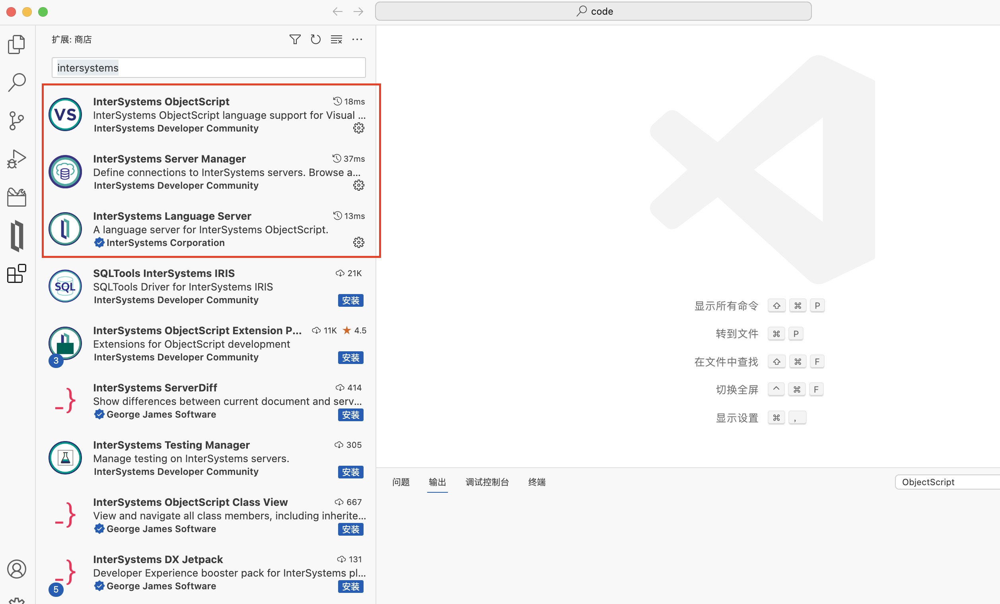
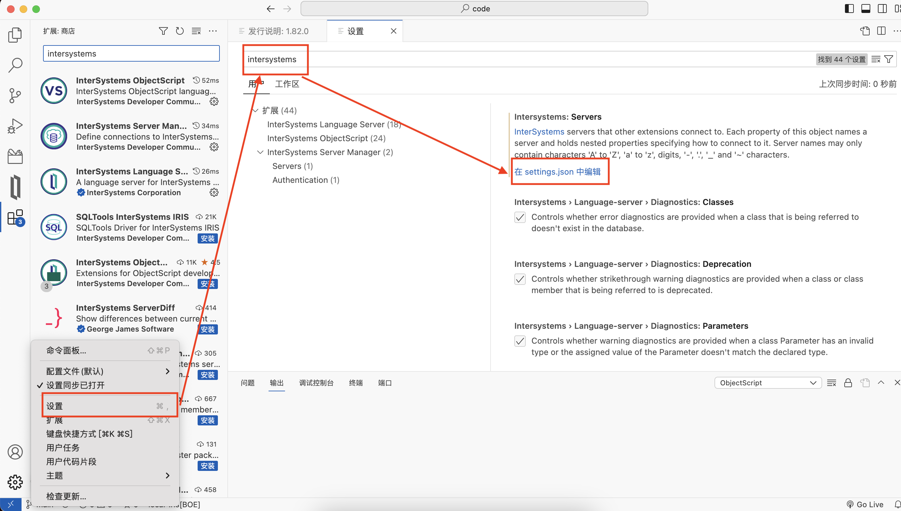
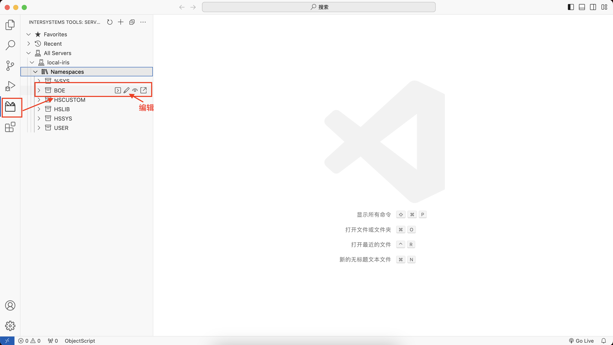
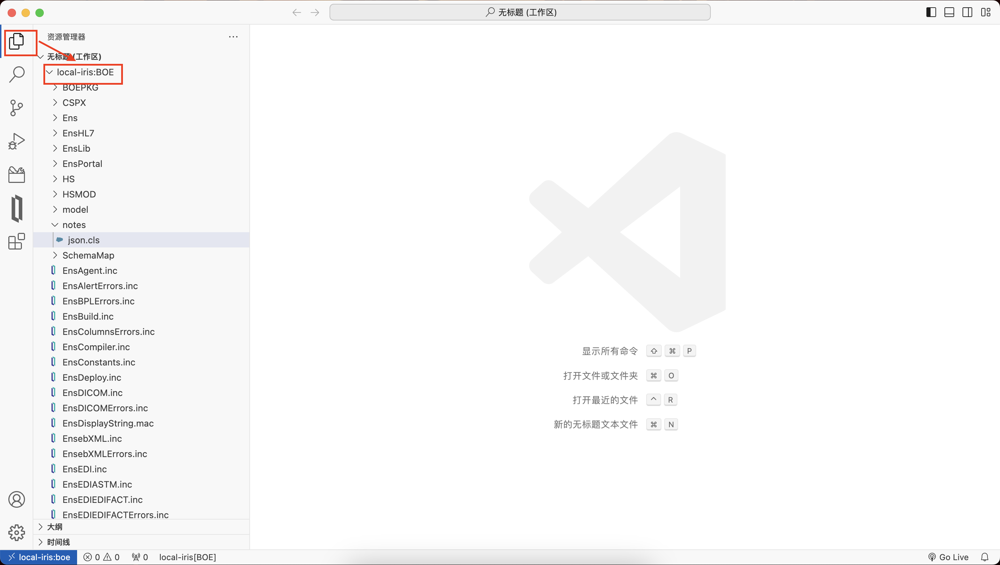
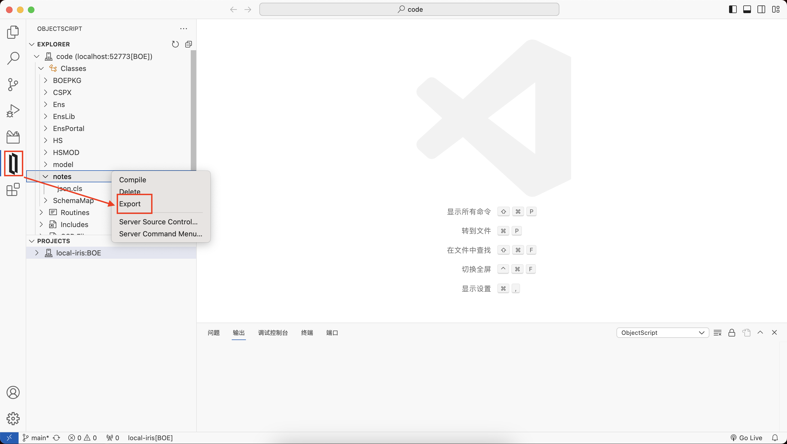
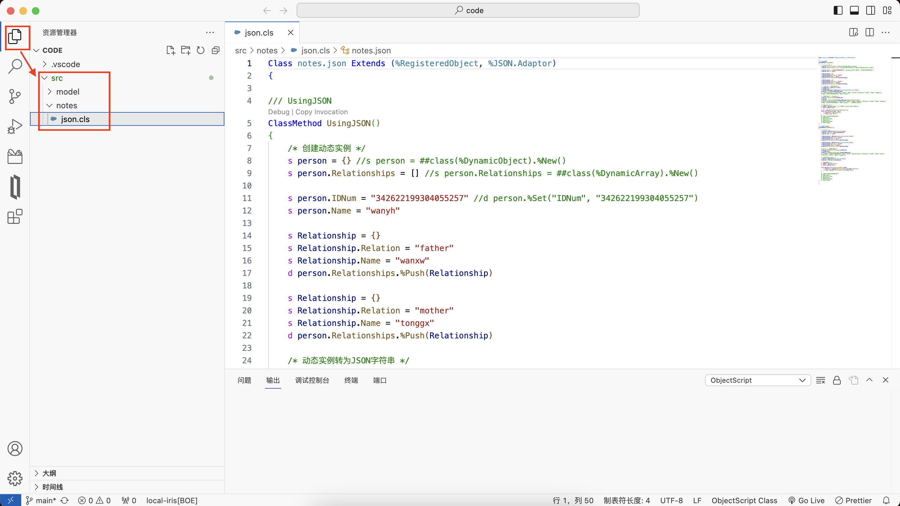
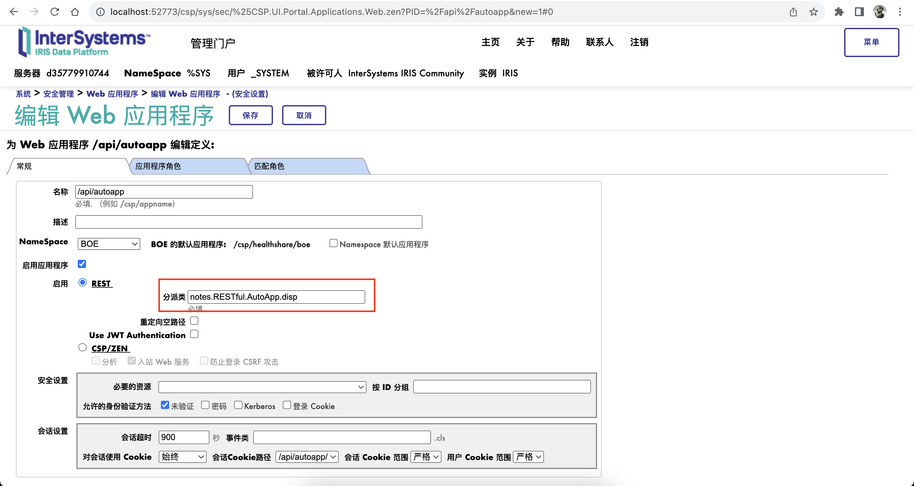
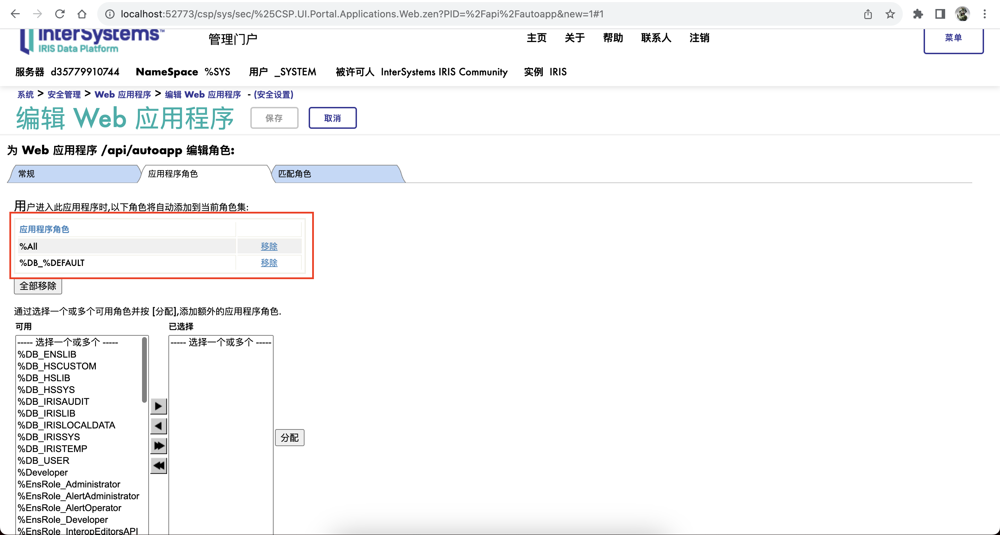
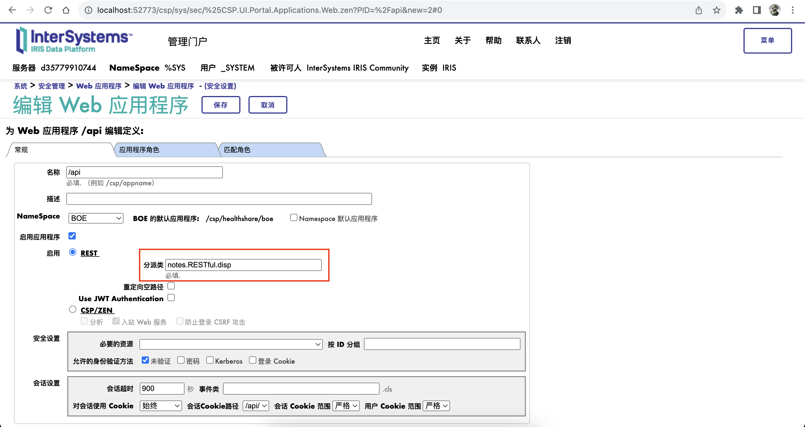
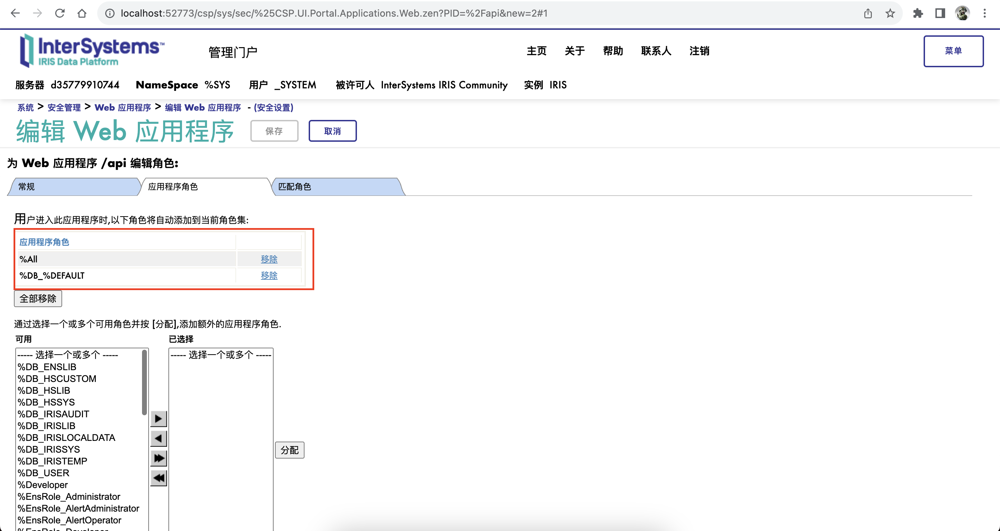

# IRIS

# 1 iris安装和开发工具

## 1.1 IRIS Docker的安装

```bash
$ docker pull containers.intersystems.com/intersystems/irishealth-community:latest-cd
5c939e3a4d10: Pull complete
c63719cdbe7a: Pull complete
19a861ea6baf: Pull complete
651c9d2d6c4f: Pull complete
d21839215a64: Pull complete
7995f836674b: Pull complete
841ee3aaa7aa: Pull complete
739c318c2223: Pull complete
d76886412dda: Pull complete
Digest: sha256:4c62690f4d0391d801d3ac157dc4abbf47ab3d8f6b46144288e0234e68f8f10e
Status: Downloaded newer image for containers.intersystems.com/intersystems/irishealth-community:latest-cd
containers.intersystems.com/intersystems/irishealth-community:latest-cd

$ docker run --name irishealth -d -p 1972:1972 -p 52773:52773 containers.intersystems.com/intersystems/irishealth-community:latest-cd

$ docker exec -it iris /bin/bash
irisowner@cb9383e4f127:~$ iris session iris
Node: cb9383e4f127, Instance: IRIS
USER>
```

## 1.2 使用VSCode开发

**1. 扩展安装**



**2. 配置**

设置 -> 扩展 -> InterSystems Server Manager -> settings.json



```json
{
  "intersystems.servers": {
    "local-iris": {
      "webServer": {
        "scheme": "http",
        "host": "localhost",
        "port": 52773
      },
      "askForPassword": false,
      "username": "_system",
      "password": "SYS",
      "description": "local iris"
    }
  },
  "objectscript.conn": {
    "host": "localhost",
    "port": 52773,
    "username": "_system",
    "password": "SYS",
    "ns": "boe",
    "active": true,
    "server": "local-iris"
},
  "terminal.integrated.detectLocale": "on",
  "intersystems.language-server.diagnostics.routines": true,
  "editor.renderControlCharacters": false,
  "editor.unicodeHighlight.ambiguousCharacters": false,
  "git.autorefresh": false,
  "git.autoRepositoryDetection": false,
  "git.confirmEmptyCommits": false,
  "git.confirmForcePush": false,
  "git.confirmNoVerifyCommit": false,
  "git.confirmSync": false,
  "git.countBadge": "off",
  "diffEditor.wordWrap": "on",
  "editor.wordWrap": "on",
  "workbench.editor.enablePreview": false,
  "git.enableSmartCommit": true,
  "explorer.confirmDelete": false,
  "editor.fontSize": 13,
  "intersystemsServerManager.credentialsProvider.deletePasswordOnSignout": "never",
  "objectscript.showProposedApiPrompt": false,
  "workbench.startupEditor": "none",
  "intersystems.language-server.suggestTheme": false,
  "workbench.colorTheme": "Default Light Modern",
  "editor.tokenColorCustomizations":{
    "textMateRules": [
        {
            "scope": "entity.other.attribute-name.objectscript_class",
            "settings": {
                "foreground": "#000000"
            }
        },
        {
            "scope": "string.quoted.double.objectscript",
            "settings": {
                "foreground": "#068306"
            }
        },
        {
            "scope": ["comment.block.documentation.objectscript_class"],
            "settings": {
                "foreground": "#040482"
            }
        }
    ]
  }
}
```

**3. 直连代码**

   a. Instersystems tools – All Servers – 【服务器名】– NameSpace – 命名空间，选择要编辑的代码，点击编辑；


   

   b. 代码即可直接在工作区编辑。

   

**4. 客户端方式**

   a. 本地建立文件夹：`./iris/code`；

   b. vscode打开此文件夹；

   c. 点击ObjectScript图标，选择需要编辑的代码 - 右键 - 选择Export；

   

   d. 等待导出完毕，代码会出现在src目录下，可配置git进行代码管理。

   


# 2 使用JSON指南

**`notes.json`**

```java
Class notes.json Extends (%RegisteredObject, %JSON.Adaptor)
{

/// Using Object
ClassMethod JSONObject()
{
	/* 创建动态实例 */
	s person = {} //s person = ##class(%DynamicObject).%New()
	s person.Relationships = [] //s person.Relationships = ##class(%DynamicArray).%New()

	s person.IDNum = "342622199304055257" //d person.%Set("IDNum", "342622199304055257")
	s person.Name = "wanyh" 

	s Relationship = {}
    s Relationship.Relation = "father"
    s Relationship.Name = "wanxw"
	d person.Relationships.%Push(Relationship)
	
	s Relationship = {}
    s Relationship.Relation = "mother"
    s Relationship.Name = "tonggx"
	d person.Relationships.%Push(Relationship)

	/* 动态实例转为JSON字符串 */
    s jsonPerson = person.%ToJSON()
	w jsonPerson,!
	s jsonPersonStream = ##class(%Stream.GlobalCharacter).%New()
	d person.%ToJSON(jsonPersonStream)
	#; {"Relationships":[{"Relation":"father","Name":"wanxw"},{"Relation":"mother","Name":"tonggx"}],"IDNum":"342622199304055257","Name":"wanyh"}
	
	/* JSON字符串转为动态实例 */
	s person = {}.%FromJSON(jsonPerson)
	zw person
	s person = {}.%FromJSON(jsonPersonStream.ReadLineIntoStream())
	#; person={"Relationships":[{"Relation":"father","Name":"wanxw"},{"Relation":"mother","Name":"tonggx"}],"IDNum":"342622199304055257","Name":"wanyh"}  ; <DYNAMIC OBJECT>
	
	/* 解析动态实例 */
	w "IDNum:"_person.IDNum,! //w "IDNum:"_person.%Get("IDNum"),!
	w "Name:"_person.Name,!
	
	s itr = person.Relationships.%GetIterator()
	while itr.%GetNext(.key, .val){
		w "Relation:"_val.Relation,!
		w "Name:"_val."Name",!
	}
	#; IDNum:342622199304055257
	#; Name:wanyh
	#; Relation:father
	#; Name:wanxw
	#; Relation:mother
	#; Name:tonggx
}

/// %JSON.Adaptor
ClassMethod JSONAdaptor()
{
	/* 创建对象 */
	s person = ##class(model.Person).%New()
	s person.IDCard = "342622199304055257"
	s person.Name = "wanyh"
	
	s Relationship = ##class(model.Relationship).%New()
	s Relationship.Relation = "father"
	s Relationship.Name = "wanxw"
	d person.Relationships.Insert(Relationship)

	s Relationship = ##class(model.Relationship).%New()
	s Relationship.Relation = "mother"
	s Relationship.Name = "tonggx"
	d person.Relationships.Insert(Relationship)
	
	/* 对象导出为JSON字符串 */
	d person.%JSONExportToString(.jsonPerson)
	w jsonPerson,!
	d person.%JSONExportToStream(.jsonStreamPerson)
	#; {"IDNum":"342622199304055257","Name":"wanyh","Relationships":[{"Relation":"father","Name":"wanxw"},{"Relation":"mother","Name":"tonggx"}]}
	
	/* JSON字符串导入对象 */
	s person = ##class(model.Person).%New()
	d person.%JSONImport(jsonPerson)
	
	/* 解析JSON对象 */ 
	w "IDNum:"_person.IDCard,!
	w "Name:"_person.Name,!

	while person.Relationships.GetNext(.key){
		w "Relation:"_person.Relationships.GetAt(key).Relation,!
		w "Name:"_person.Relationships.GetAt(key).Name,! 
	}
	
	#; IDNum:342622199304055257
	#; Name:wanyh
	#; Relation:father
	#; Name:wanxw
	#; Relation:mother
	#; Name:tonggx
}

}
```

**`model.Person`**

```java
Class model.Person Extends (%RegisteredObject, %JSON.Adaptor)
{

/// Person's IDCard number.
Property IDCard As %String(%JSONFIELDNAME = "IDNum", PATTERN = "18N") [ Required ];

/// Name of the person.
Property Name As %String;

/// Person's Relationships.
Property Relationships As list Of model.Relationship;

}
```

**`model.Relationship`**

```java
Class model.Relationship Extends (%RegisteredObject, %JSON.Adaptor)
{

/// Relation description.
Property Relation As %String;

/// Name of the person.
Property Name As %String;

}
```


# 3 发送HTTP请求

**`notes.HttpRequest`**

```java
Class notes.HttpRequest Extends %RegisteredObject
{

/// Amap WebApi Key
Parameter AMAPAPIKEY = "6225218d56b310eccc2ac4b4d280dd39";

/// Sending HTTP Request
ClassMethod SendHttpRequest()
{
	/* 创建%Net.HttpRequest的实例，设置实例属性 */
    s request = ##class(%Net.HttpRequest).%New()
	s request.Server = "restapi.amap.com" //IP
	s request.Port = "80" //端口
	s request.Location = "/v3/weather/weatherInfo" //地址
	s request.Timeout = 3 //等待超时
	
	#; /* 发送HTTP GET请求 */
	#; d request.InsertParam("key", ..#AMAPAPIKEY) //插入参数
	#; d request.InsertParam("city", "340124")
    #; d request.InsertParam("extensions", "all")
	#; s status = request.Get()

	/* 发送HTTP POST请求 */
	d request.InsertFormData("key",..#AMAPAPIKEY) //发送表单
	d request.InsertFormData("city","340124")
	d request.InsertFormData("extensions", "all")
	s status = request.Post()

	/* 接收HTTP响应 */
	if $$$ISERR(status){
		do $system.OBJ.DisplayError()
	}else{
		s response = request.HttpResponse
		s statusCode = response.StatusCode
		s data = response.Data
		s dataObj = {}.%FromJSON(data)
		s forecasts = dataObj.forecasts
		s itr = forecasts.%GetIterator()
		while itr.%GetNext(.key, .val){
			s province = val.province
			s city = val.city
            s reporttime = val.reporttime
            w province_city_" "_reporttime_" 播报：",!
            s casts = val.casts
            s itr = casts.%GetIterator()
            while itr.%GetNext(.key, .val){
			    s date = val.date
			    s week = $CASE(val.week, 1:"星期一", 2:"星期二", 3:"星期三", 4:"星期四", 5:"星期五", 6:"星期六", 7:"星期日")
                s dayweather = val.dayweather
                s nightweather = val.nightweather
                s daytemp = val.daytemp
                s nighttemp = val.nighttemp
                s daywind = val.daywind
                s nightwind = val.nightwind
                s daypower = val.daypower
                s nightpower = val.nightpower
			    w date_" "_week_"：白天，"_dayweather_" "_daytemp_"℃ ，"_daywind_"风"_daypower_"级；"_"夜晚，"_nightweather_" "_nighttemp_"℃ ，"_nightwind_"风"_nightpower_"级。",!
            }
		}
	}

	/* Others */
	#; s request.Https=1 //https连接
	#; s request.Port=443
	#; s request.SSLConfiguration="MySSLConfiguration"

	#; s request.Username="10695144-4GA075FF" //认证方式1
	#; s request.Password="welcome1"
	#; d request.SetHeader("Authorization",token) //认证方式2  //设置标头
		
	#; d request.EntityBody.SetAttribute("CONTENT-TYPE","application/json")  //请求主体
	#; s jsonStream = ##class(%Stream.GlobalCharacter).%New()
	#; d jsonObj.%ToJSON(jsonStream) 
	#; d request.EntityBody.CopyFrom(jsonStream)
}

}

```


# 4 创建REST服务

## 4.1 OpenAPI 2.0规范创建REST服务示例

**1. 生成服务类：`/api/mgmnt`**

`http://localhost:52773/api/mgmnt/v2/boe/notes.RESTful.AutoApp?IRISUsername=_system&IRISPassword=SYS`


**2. 应用程序：`/api/autoapp`**





**规范类：`notes.RESTful.AutoApp.spec`**

```java
Class notes.RESTful.AutoApp.spec Extends %REST.Spec [ ProcedureBlock ]
{

XData OpenAPI [ MimeType = application/json ]
{
{
  "info":{
    "title":"",
    "description":"",
    "version":"",
    "x-ISC_Namespace":"boe"
  },
  "basePath":"/api/autoapp",
  "paths":{
    "/resource":{
      "get":{
        "operationId":"GetResourceById",
        "description":" GET http://localhost:52773/api/autoapp/resource ",
        "x-ISC_ServiceMethod":"GetResourceById",
        "responses":{
          "default":{
            "description":"(Unexpected Error)"
          },
          "200":{
            "description":"(Expected Result)"
          }
        }
      },
      "post":{
        "operationId":"CreateResource",
        "description":" POST http://localhost:52773/api/autoapp/resource ",
        "x-ISC_ServiceMethod":"CreateResource",
        "parameters":[
          {
            "name":"payloadBody",
            "in":"body",
            "description":"Request body contents",
            "required":false,
            "schema":{
              "type":"string"
            }
          }
        ],
        "responses":{
          "default":{
            "description":"(Unexpected Error)"
          },
          "200":{
            "description":"(Expected Result)"
          }
        }
      }
    }
  },
  "swagger":"2.0"
}
}

}

```

**分派类：`notes.RESTful.AutoApp.disp`**

```java
/// Dispatch class defined by RESTSpec in notes.RESTful.AutoApp.spec
Class notes.RESTful.AutoApp.disp Extends %CSP.REST [ GeneratedBy = notes.RESTful.AutoApp.spec.cls, ProcedureBlock ]
{

/// The class containing the RESTSpec which generated this class
Parameter SpecificationClass = "notes.RESTful.AutoApp.spec";

/// Ignore any writes done directly by the REST method.
Parameter IgnoreWrites = 1;

/// By default convert the input stream to Unicode
Parameter CONVERTINPUTSTREAM = 1;

/// The default response charset is utf-8
Parameter CHARSET = "utf-8";

XData UrlMap [ XMLNamespace = "http://www.intersystems.com/urlmap" ]
{
<Routes>
  <Route Url="/resource" Method="get" Call="GetResourceById" />
  <Route Url="/resource" Method="post" Call="CreateResource" />
</Routes>
}

ClassMethod GetResourceById() As %Status
{
    Try {
        Set response=##class(notes.RESTful.AutoApp.impl).GetResourceById()
        Do ##class(notes.RESTful.AutoApp.impl).%WriteResponse(response)
    } Catch (ex) {
        Do ##class(%REST.Impl).%ReportRESTError(..#HTTP500INTERNALSERVERERROR,ex.AsStatus(),$parameter("notes.RESTful.AutoApp.impl","ExposeServerExceptions"))
    }
    Quit $$$OK
}

ClassMethod CreateResource() As %Status
{
    Try {
        If $isobject(%request.Content) Set ppayloadBody=%request.Content
        Set response=##class(notes.RESTful.AutoApp.impl).CreateResource(.ppayloadBody)
        Do ##class(notes.RESTful.AutoApp.impl).%WriteResponse(response)
    } Catch (ex) {
        Do ##class(%REST.Impl).%ReportRESTError(..#HTTP500INTERNALSERVERERROR,ex.AsStatus(),$parameter("notes.RESTful.AutoApp.impl","ExposeServerExceptions"))
    }
    Quit $$$OK
}

}

```

**实现类：`notes.RESTful.AutoApp.impl`**

```java
/// Business logic class defined by OpenAPI in notes.RESTful.AutoApp.spec<br/>
/// Updated Sep 22, 2023 16:15:09
Class notes.RESTful.AutoApp.impl Extends %REST.Impl [ ProcedureBlock ]
{

/// If ExposeServerExceptions is true, then details of internal errors will be exposed.
Parameter ExposeServerExceptions = 0;

/// GET http://localhost:52773/api/autoapp/resource
ClassMethod GetResourceById() As %Stream.Object
{
    //(Place business logic here)
    //Do ..%SetStatusCode(<HTTP_status_code>)
    //Do ..%SetHeader(<name>,<value>)
    //Quit (Place response here) ; response may be a string, stream or dynamic object
    Try {
	    s Id = %request.Data("Id",1)
        #; ...
	    return {"message": "success"}
    } Catch (ex) {
        d ##class(%REST.Impl).%SetStatusCode("500")
        return {"errormessage": "Server error"}
   }
}

/// POST http://localhost:52773/api/autoapp/resource<br/>
/// The method arguments hold values for:<br/>
///     payloadBody, Request body contents<br/>
ClassMethod CreateResource(payloadBody As %Stream.Object) As %Stream.Object
{
    //(Place business logic here)
    //Do ..%SetStatusCode(<HTTP_status_code>)
    //Do ..%SetHeader(<name>,<value>)
    //Quit (Place response here) ; response may be a string, stream or dynamic object
    Try {
	    s tObj = {}.%FromJSON(payloadBody)
        #; ...
	    return {"message": "success"}

    } Catch (ex) {
        d ##class(%REST.Impl).%SetStatusCode("500")
        return {"errormessage": "Server error"}
   }
}

}

```

## 4.2 手动创建REST服务示例

**1. 应用程序：`/api`**





**2. 分派类：`notes.RESTful.disp` `notes.RESTful.ManualApp.disp`**

**`notes.RESTful.disp`**

```java
/// 总分发类
Class notes.RESTful.disp Extends %CSP.REST
{

Parameter HandleCorsRequest = 0;

XData UrlMap [ XMLNamespace = "https://www.intersystems.com/urlmap" ]
{
<Routes>
	<Map Prefix="/manualapp" Forward="notes.RESTful.ManualApp.disp"/>
</Routes>
}

}

```

**`notes.RESTful.ManualApp.disp`**

```java
/// 分发类
Class notes.RESTful.ManualApp.disp Extends %CSP.REST
{

Parameter HandleCorsRequest = 0;

XData UrlMap [ XMLNamespace = "https://www.intersystems.com/urlmap" ]
{
<Routes>
	 <Route Url = "/resource" Method = "GET" Call = "GetResourceById" />
	 <Route Url = "/resource" Method = "POST" Call = "CreateResource" />
</Routes>
}

/// GET http://localhost:52773/api/manualapp/resource
ClassMethod GetResourceById() As %Status
{
    Try {
        d ##class(%REST.Impl).%SetContentType("application/json")
        if '##class(%REST.Impl).%CheckAccepts("application/json"){
	    	d ##class(%REST.Impl).%ReportRESTError(..#HTTP406NOTACCEPTABLE, $$$ERROR($$$RESTBadAccepts))
	    	q  
	    }
        s response = ##class(notes.RESTful.ManualApp.impl).GetResourceById()
        d ##class(%REST.Impl).%WriteResponse(response)
    } Catch (ex) {
        d ##class(%REST.Impl).%SetStatusCode("400")
        return {"errormessage": "Client error"}
    }
    q $$$OK
}

/// POST http://localhost:52773/api/manualapp/resource
ClassMethod CreateResource() As %Status
{
    Try {
        d ##class(%REST.Impl).%SetContentType("application/json")
        if '##class(%REST.Impl).%CheckAccepts("application/json"){
	    	d ##class(%REST.Impl).%ReportRESTError(..#HTTP406NOTACCEPTABLE, $$$ERROR($$$RESTBadAccepts))
	    	q  
	    }
	    if $isobject(%request.Content) s ppayloadBody=%request.Content
        s response = ##class(notes.RESTful.ManualApp.impl).CreateResource(.ppayloadBody)
        d ##class(%REST.Impl).%WriteResponse(response)
    } Catch (ex) {
        d ##class(%REST.Impl).%SetStatusCode("400")
        return {"errormessage": "Client error"}
    }
    q $$$OK
}

}

```

**3. 实现类：`notes.RESTful.ManualApp.impl`**

```java
/// 实现类
Class notes.RESTful.ManualApp.impl Extends %CSP.REST
{

ClassMethod GetResourceById() As %DynamicObject
{
    Try {
	    s Id = %request.Data("Id",1)
        #; ...
	    return {"message": "success"}
    } Catch (ex) {
        d ##class(%REST.Impl).%SetStatusCode("500")
        return {"errormessage": "Server error"}
   }
}

ClassMethod CreateResource(payloadBody As %Stream.Object) As %DynamicObject
{
    Try {
	    s tObj = {}.%FromJSON(payloadBody)
        #; ...
	    return {"message": "success"}

    } Catch (ex) {
        d ##class(%REST.Impl).%SetStatusCode("500")
        return {"errormessage": "Server error"}
   }
}

}

```


# 5 使用XML指南

**`Notes.XML`**

```java
Class notes.XML Extends (%RegisteredObject, %XML.Adaptor)
{

/// %XML.Writer
ClassMethod XMLWrite()
{
	s obj = ##class(model.Person).%New()
	s obj.IDCard = "340124202003054873"
	s obj.Name = "wansk"
	s rObj = ##class(model.Relationship).%New()
	s rObj.Name = "wanyh"
	s rObj.Relation = "father"
	d obj.Relationships.Insert(rObj)

	//1. 对象写入XML输出
	// 创建实例
	s writer = ##class(%XML.Writer).%New()
	s writer.Indent = 1 //设置缩进
	
	// 读取对象
	#;	d writer.OutputToString()
	#;	d writer.RootObject(obj)
	#;	s xml = writer.GetXMLString()
	#;	w xml ,!
	s status = writer.OutputToStream(.stream)
	i $$$ISERR(status) {d $System.Status.DisplayError(status) q}
	s status = writer.RootObject(obj)
	i $$$ISERR(status) {d $System.Status.DisplayError(status) q}
	w stream.Read() ,!

	// XMLExportToStream
	#;	d obj.XMLExportToStream(.Stream)
	
	//2. 手动编写XML输出
	set xml=##class(%XML.Writer).%New()
	s xml.Indent = 1
	d xml.OutputToStream(.stream)
	d xml.RootElement("Person")
		d xml.Element("IDCard"), xml.Write("340124202003054873") ,xml.EndElement()
		d xml.Element("Name"), xml.Write("wansk") ,xml.EndElement()
		d xml.Element("Relationships")
			d xml.Element("Relationship")
				d xml.Element("Relation"), xml.Write("father") ,xml.EndElement()
				d xml.Element("Name"), xml.Write("wanyh") ,xml.EndElement()
			d xml.EndElement()
			d xml.Element("Relationship")
				d xml.Element("Relation"), xml.Write("mother") ,xml.EndElement()
				d xml.Element("Name"), xml.Write("lumina") ,xml.EndElement()
			d xml.EndElement()
		d xml.EndElement()
	d xml.EndRootElement()
	w stream.Read() ,!
}

/// %XML.Reader
ClassMethod XMLReader()
{
	s str =			"<Person>"
	s str =	str _		"<IDCard>340124202003054873</IDCard>"			
	s str =	str _		"<Name>wansk</Name>"
    s str =	str _		"<Relationships>"
    s str =	str _			"<Relationship>"
    s str =	str _				"<Relation>father</Relation>"
    s str =	str _				"<Name>wanyh</Name>"
    s str =	str _			"</Relationship>"
    s str =	str _			"<Relationship>"
    s str =	str _				"<Relation>mother</Relation>"
    s str =	str _				"<Name>lumina</Name>"
    s str =	str _			"</Relationship>"
    s str =	str _		"</Relationships>"
	s str =	str _	"</Person>"
	
	#; 1. XMLReader
	// 创建实例,导入XML
	s reader = ##class(%XML.Reader).%New()
	s status = reader.OpenString(str)
	#; status = reader.OpenStream(Stream)
	i $$$ISERR(status) {d $System.Status.DisplayError(status) q}
	
	// 将XML导入对象
	d reader.CorrelateRoot("model.Person")
	d reader.Next(.object, .status)
	i $$$ISERR(status) {d $System.Status.DisplayError(status) q}
	
	w "IDCard：", object.IDCard ,!
	w "Name：",  object.Name ,!
	w "RelationshipCount：",  object.Relationships.Count() ,!
	for i = 1 : 1 :object.Relationships.Count() {
		w "Relation:"_object.Relationships.GetAt(i).Relation ,!
		w "Name:"_object.Relationships.GetAt(i).Name ,!
	}
	
	
	#; 2. %XML.XPATH.Document
	s tSC = ##class(%XML.XPATH.Document).CreateFromString(str,.tDocument)
	#; s tSC = ##class(%XML.XPATH.Document).CreateFromStream(Input,.tDocument)
	i $$$ISERR(tSC) {d $System.Status.DisplayError(tSC) q}
	set tSC = tDocument.EvaluateExpression("/Person/IDCard","text()",.tRes)
	if ($$$ISOK(tSC) && (tRes.GetAt(1) '= "")){    
    	s fieldValue=tRes.GetAt(1).Value
    	s IDCard=$tr(fieldValue,$c(0),"")
    	w "IDCard：", IDCard ,!
   	}
   	set tSC = tDocument.EvaluateExpression("/Person/Name","text()",.tRes)
	if ($$$ISOK(tSC) && (tRes.GetAt(1) '= "")){    
    	s fieldValue=tRes.GetAt(1).Value
    	s Name=$tr(fieldValue,$c(0),"")
    	w "Name：", Name ,!
   	}
   	
   	set tSC=tDocument.EvaluateExpression("/Person/Relationships","count(Relationship)",.tRes)
   	if ($$$ISOK(tSC)&&(tRes.GetAt(1)'="")){
 		set hsCount=tRes.GetAt(1).Value
 		w "RelationshipCount：", hsCount ,!
		for i=1:1:hsCount {
			set tSC=tDocument.EvaluateExpression("/Person/Relationships/Relationship["_i_"]/Relation","text()",.tRes)                    
			if ($$$ISOK(tSC)&&(tRes.GetAt(1)'="")){    
         		set fieldValue=tRes.GetAt(1).Value
         		set Relation=$tr(fieldValue,$c(0),"")
      			w "Relation：", Relation ,!
       		} 
      		set tSC=tDocument.EvaluateExpression("/Person/Relationships/Relationship["_i_"]/Name","text()",.tRes)                    
    		if ($$$ISOK(tSC)&&(tRes.GetAt(1)'="")){    
        		set fieldValue=tRes.GetAt(1).Value
      			set Name=$tr(fieldValue,$c(0),"")
            	w "Name：", Name ,!
        	} 
    	}
   	}
}

}
```

**`model.Person` **

```java
Class model.Person Extends (%RegisteredObject, %XML.Adaptor, %JSON.Adaptor)
{

/// Person's IDCard number.
Property IDCard As %String;

/// Name of the person.
Property Name As %String;

/// Person's Relationships.
Property Relationships As list Of model.Relationship;

}
```

**`model.Relationship`**

```java
Class model.Relationship Extends (%RegisteredObject, %XML.Adaptor, %JSON.Adaptor)
{

/// Relation description.
Property Relation As %String;

/// Name of the person.
Property Name As %String;

}
```
