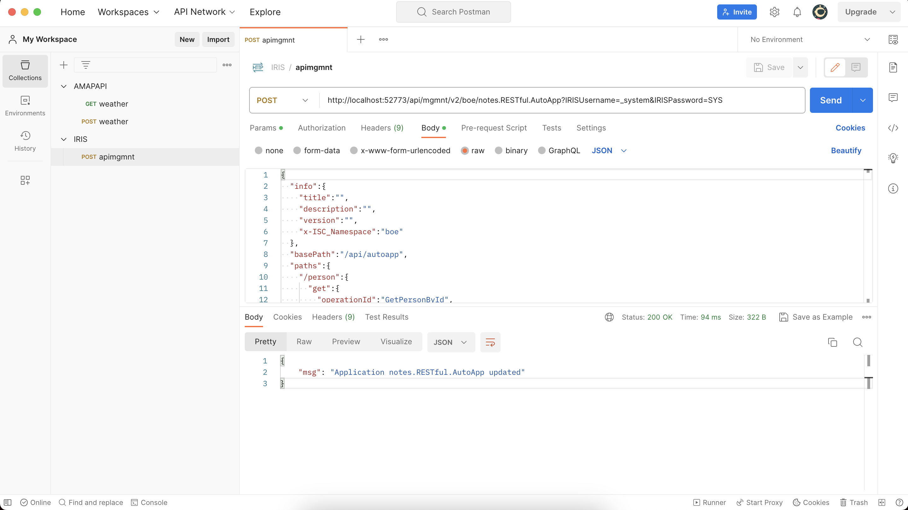
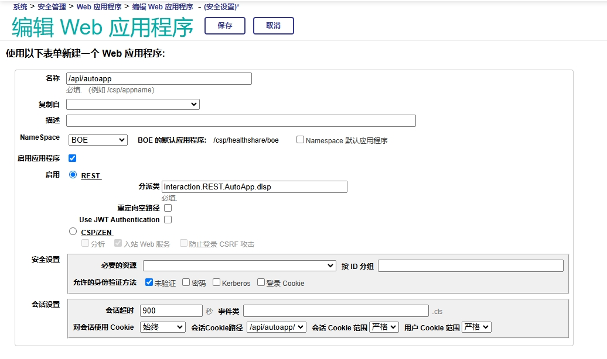
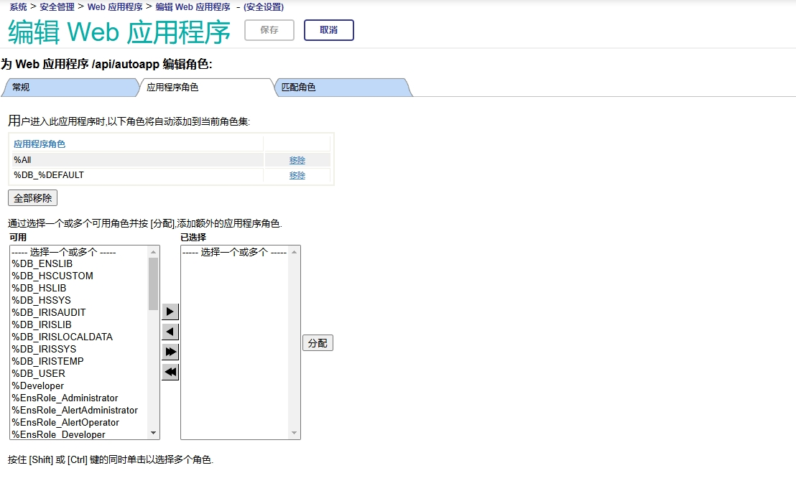
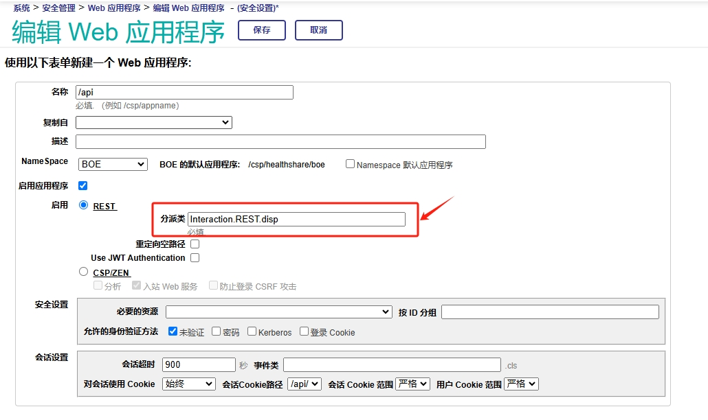
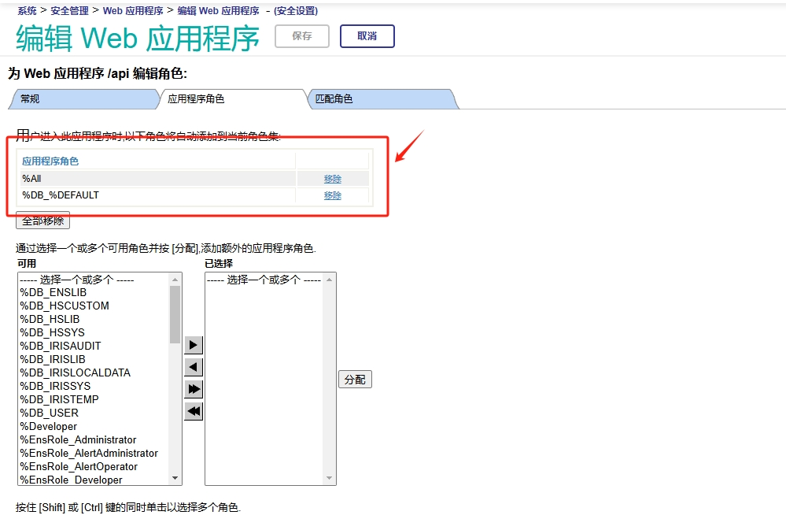
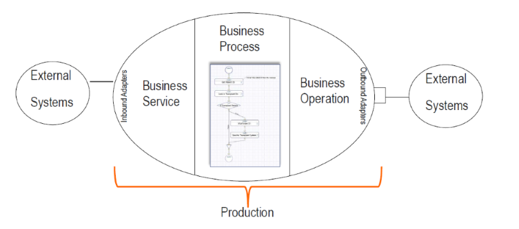

# 服务交互

## 1 使用JSON指南

**`notes.json`**

```java
Class notes.json Extends (%RegisteredObject, %JSON.Adaptor)
{

/// Using Object
ClassMethod JSONObject()
{
	/* 创建动态实例 */
	s person = {} //s person = ##class(%DynamicObject).%New()
	s person.Relationships = [] //s person.Relationships = ##class(%DynamicArray).%New()

	s person.IDNum = "342622199304055257" //d person.%Set("IDNum", "342622199304055257")
	s person.Name = "wanyh" 

	s Relationship = {}
    s Relationship.Relation = "father"
    s Relationship.Name = "wanxw"
	d person.Relationships.%Push(Relationship)
	
	s Relationship = {}
    s Relationship.Relation = "mother"
    s Relationship.Name = "tonggx"
	d person.Relationships.%Push(Relationship)

	/* 动态实例转为JSON字符串 */
    s jsonPerson = person.%ToJSON()
	w jsonPerson,!
	s jsonPersonStream = ##class(%Stream.GlobalCharacter).%New()
	d person.%ToJSON(jsonPersonStream)
	#; {"Relationships":[{"Relation":"father","Name":"wanxw"},{"Relation":"mother","Name":"tonggx"}],"IDNum":"342622199304055257","Name":"wanyh"}
	
	/* JSON字符串转为动态实例 */
	s person = {}.%FromJSON(jsonPerson)
	zw person
	s person = {}.%FromJSON(jsonPersonStream.ReadLineIntoStream())
	#; person={"Relationships":[{"Relation":"father","Name":"wanxw"},{"Relation":"mother","Name":"tonggx"}],"IDNum":"342622199304055257","Name":"wanyh"}  ; <DYNAMIC OBJECT>
	
	/* 解析动态实例 */
	w "IDNum:"_person.IDNum,! //w "IDNum:"_person.%Get("IDNum"),!
	w "Name:"_person.Name,!
	
	s itr = person.Relationships.%GetIterator()
	while itr.%GetNext(.key, .val){
		w "Relation:"_val.Relation,!
		w "Name:"_val."Name",!
	}
	#; IDNum:342622199304055257
	#; Name:wanyh
	#; Relation:father
	#; Name:wanxw
	#; Relation:mother
	#; Name:tonggx
}

/// %JSON.Adaptor
ClassMethod JSONAdaptor()
{
	/* 创建对象 */
	s person = ##class(model.Person).%New()
	s person.IDCard = "342622199304055257"
	s person.Name = "wanyh"
	
	s Relationship = ##class(model.Relationship).%New()
	s Relationship.Relation = "father"
	s Relationship.Name = "wanxw"
	d person.Relationships.Insert(Relationship)

	s Relationship = ##class(model.Relationship).%New()
	s Relationship.Relation = "mother"
	s Relationship.Name = "tonggx"
	d person.Relationships.Insert(Relationship)
	
	/* 对象导出为JSON字符串 */
	d person.%JSONExportToString(.jsonPerson)
	w jsonPerson,!
	d person.%JSONExportToStream(.jsonStreamPerson)
	#; {"IDNum":"342622199304055257","Name":"wanyh","Relationships":[{"Relation":"father","Name":"wanxw"},{"Relation":"mother","Name":"tonggx"}]}
	
	/* JSON字符串导入对象 */
	s person = ##class(model.Person).%New()
	d person.%JSONImport(jsonPerson)
	
	/* 解析JSON对象 */ 
	w "IDNum:"_person.IDCard,!
	w "Name:"_person.Name,!

	while person.Relationships.GetNext(.key){
		w "Relation:"_person.Relationships.GetAt(key).Relation,!
		w "Name:"_person.Relationships.GetAt(key).Name,! 
	}
	
	#; IDNum:342622199304055257
	#; Name:wanyh
	#; Relation:father
	#; Name:wanxw
	#; Relation:mother
	#; Name:tonggx
}

}
```

**`model.Person`**

```java
Class model.Person Extends (%RegisteredObject, %JSON.Adaptor)
{

/// Person's IDCard number.
Property IDCard As %String(%JSONFIELDNAME = "IDNum", PATTERN = "18N") [ Required ];

/// Name of the person.
Property Name As %String;

/// Person's Relationships.
Property Relationships As list Of model.Relationship;

}
```

**`model.Relationship`**

```java
Class model.Relationship Extends (%RegisteredObject, %JSON.Adaptor)
{

/// Relation description.
Property Relation As %String;

/// Name of the person.
Property Name As %String;

}
```


## 2 发送HTTP请求

**`notes.HttpRequest`**

```java
Class notes.HttpRequest Extends %RegisteredObject
{

/// Amap WebApi Key
Parameter AMAPAPIKEY = "6225218d56b310eccc2ac4b4d280dd39";

/// Sending HTTP Request
ClassMethod SendHttpRequest()
{
	/* 创建%Net.HttpRequest的实例，设置实例属性 */
    s request = ##class(%Net.HttpRequest).%New()
	s request.Server = "restapi.amap.com" //IP
	s request.Port = "80" //端口
	s request.Location = "/v3/weather/weatherInfo" //地址
	s request.Timeout = 3 //等待超时
	
	#; /* 发送HTTP GET请求 */
	#; d request.InsertParam("key", ..#AMAPAPIKEY) //插入参数
	#; d request.InsertParam("city", "340124")
    #; d request.InsertParam("extensions", "all")
	#; s status = request.Get()

	/* 发送HTTP POST请求 */
	d request.InsertFormData("key",..#AMAPAPIKEY) //发送表单
	d request.InsertFormData("city","340124")
	d request.InsertFormData("extensions", "all")
	s status = request.Post()

	/* 接收HTTP响应 */
	if $$$ISERR(status){
		do $system.OBJ.DisplayError()
	}else{
		s response = request.HttpResponse
		s statusCode = response.StatusCode
		s data = response.Data
		s dataObj = {}.%FromJSON(data)
		s forecasts = dataObj.forecasts
		s itr = forecasts.%GetIterator()
		while itr.%GetNext(.key, .val){
			s province = val.province
			s city = val.city
            s reporttime = val.reporttime
            w province_city_" "_reporttime_" 播报：",!
            s casts = val.casts
            s itr = casts.%GetIterator()
            while itr.%GetNext(.key, .val){
			    s date = val.date
			    s week = $CASE(val.week, 1:"星期一", 2:"星期二", 3:"星期三", 4:"星期四", 5:"星期五", 6:"星期六", 7:"星期日")
                s dayweather = val.dayweather
                s nightweather = val.nightweather
                s daytemp = val.daytemp
                s nighttemp = val.nighttemp
                s daywind = val.daywind
                s nightwind = val.nightwind
                s daypower = val.daypower
                s nightpower = val.nightpower
			    w date_" "_week_"：白天，"_dayweather_" "_daytemp_"℃ ，"_daywind_"风"_daypower_"级；"_"夜晚，"_nightweather_" "_nighttemp_"℃ ，"_nightwind_"风"_nightpower_"级。",!
            }
		}
	}

	/* Others */
	#; s request.Https=1 //https连接
	#; s request.Port=443
	#; s request.SSLConfiguration="MySSLConfiguration"

	#; s request.Username="10695144-4GA075FF" //认证方式1
	#; s request.Password="welcome1"
	#; d request.SetHeader("Authorization",token) //认证方式2  //设置标头
		
	#; d request.EntityBody.SetAttribute("CONTENT-TYPE","application/json")  //请求主体
	#; s jsonStream = ##class(%Stream.GlobalCharacter).%New()
	#; d jsonObj.%ToJSON(jsonStream) 
	#; d request.EntityBody.CopyFrom(jsonStream)
}

}

```


## 3 创建REST服务

### 3.1 OpenAPI 2.0规范创建REST服务示例

**1. 生成服务类：`/api/mgmnt`**

`http://localhost:52773/api/mgmnt/v2/boe/notes.RESTful.AutoApp?IRISUsername=_system&IRISPassword=SYS`



**2. 应用程序：`/api/autoapp`**





**规范类：`notes.RESTful.AutoApp.spec`**

```java
Class notes.RESTful.AutoApp.spec Extends %REST.Spec [ ProcedureBlock ]
{

XData OpenAPI [ MimeType = application/json ]
{
{
  "info":{
    "title":"",
    "description":"",
    "version":"",
    "x-ISC_Namespace":"boe"
  },
  "basePath":"/api/autoapp",
  "paths":{
    "/resource":{
      "get":{
        "operationId":"GetResourceById",
        "description":" GET http://localhost:52773/api/autoapp/resource ",
        "x-ISC_ServiceMethod":"GetResourceById",
        "responses":{
          "default":{
            "description":"(Unexpected Error)"
          },
          "200":{
            "description":"(Expected Result)"
          }
        }
      },
      "post":{
        "operationId":"CreateResource",
        "description":" POST http://localhost:52773/api/autoapp/resource ",
        "x-ISC_ServiceMethod":"CreateResource",
        "parameters":[
          {
            "name":"payloadBody",
            "in":"body",
            "description":"Request body contents",
            "required":false,
            "schema":{
              "type":"string"
            }
          }
        ],
        "responses":{
          "default":{
            "description":"(Unexpected Error)"
          },
          "200":{
            "description":"(Expected Result)"
          }
        }
      }
    }
  },
  "swagger":"2.0"
}
}

}

```

**分派类：`notes.RESTful.AutoApp.disp`**

```java
/// Dispatch class defined by RESTSpec in notes.RESTful.AutoApp.spec
Class notes.RESTful.AutoApp.disp Extends %CSP.REST [ GeneratedBy = notes.RESTful.AutoApp.spec.cls, ProcedureBlock ]
{

/// The class containing the RESTSpec which generated this class
Parameter SpecificationClass = "notes.RESTful.AutoApp.spec";

/// Ignore any writes done directly by the REST method.
Parameter IgnoreWrites = 1;

/// By default convert the input stream to Unicode
Parameter CONVERTINPUTSTREAM = 1;

/// The default response charset is utf-8
Parameter CHARSET = "utf-8";

XData UrlMap [ XMLNamespace = "http://www.intersystems.com/urlmap" ]
{
<Routes>
  <Route Url="/resource" Method="get" Call="GetResourceById" />
  <Route Url="/resource" Method="post" Call="CreateResource" />
</Routes>
}

ClassMethod GetResourceById() As %Status
{
    Try {
        Set response=##class(notes.RESTful.AutoApp.impl).GetResourceById()
        Do ##class(notes.RESTful.AutoApp.impl).%WriteResponse(response)
    } Catch (ex) {
        Do ##class(%REST.Impl).%ReportRESTError(..#HTTP500INTERNALSERVERERROR,ex.AsStatus(),$parameter("notes.RESTful.AutoApp.impl","ExposeServerExceptions"))
    }
    Quit $$$OK
}

ClassMethod CreateResource() As %Status
{
    Try {
        If $isobject(%request.Content) Set ppayloadBody=%request.Content
        Set response=##class(notes.RESTful.AutoApp.impl).CreateResource(.ppayloadBody)
        Do ##class(notes.RESTful.AutoApp.impl).%WriteResponse(response)
    } Catch (ex) {
        Do ##class(%REST.Impl).%ReportRESTError(..#HTTP500INTERNALSERVERERROR,ex.AsStatus(),$parameter("notes.RESTful.AutoApp.impl","ExposeServerExceptions"))
    }
    Quit $$$OK
}

}

```

**实现类：`notes.RESTful.AutoApp.impl`**

```java
/// Business logic class defined by OpenAPI in notes.RESTful.AutoApp.spec<br/>
/// Updated Sep 22, 2023 16:15:09
Class notes.RESTful.AutoApp.impl Extends %REST.Impl [ ProcedureBlock ]
{

/// If ExposeServerExceptions is true, then details of internal errors will be exposed.
Parameter ExposeServerExceptions = 0;

/// GET http://localhost:52773/api/autoapp/resource
ClassMethod GetResourceById() As %Stream.Object
{
    //(Place business logic here)
    //Do ..%SetStatusCode(<HTTP_status_code>)
    //Do ..%SetHeader(<name>,<value>)
    //Quit (Place response here) ; response may be a string, stream or dynamic object
    Try {
	    s Id = %request.Data("Id",1)
        #; ...
	    return {"message": "success"}
    } Catch (ex) {
        d ##class(%REST.Impl).%SetStatusCode("500")
        return {"errormessage": "Server error"}
   }
}

/// POST http://localhost:52773/api/autoapp/resource<br/>
/// The method arguments hold values for:<br/>
///     payloadBody, Request body contents<br/>
ClassMethod CreateResource(payloadBody As %Stream.Object) As %Stream.Object
{
    //(Place business logic here)
    //Do ..%SetStatusCode(<HTTP_status_code>)
    //Do ..%SetHeader(<name>,<value>)
    //Quit (Place response here) ; response may be a string, stream or dynamic object
    Try {
	    s tObj = {}.%FromJSON(payloadBody)
        #; ...
	    return {"message": "success"}

    } Catch (ex) {
        d ##class(%REST.Impl).%SetStatusCode("500")
        return {"errormessage": "Server error"}
   }
}

}

```

### 3.2 手动创建REST服务示例

**1. 应用程序：`/api`**





**2. 分派类：`notes.RESTful.disp` `notes.RESTful.ManualApp.disp`**

**`notes.RESTful.disp`**

```java
/// 总分发类
Class notes.RESTful.disp Extends %CSP.REST
{

Parameter HandleCorsRequest = 0;

XData UrlMap [ XMLNamespace = "https://www.intersystems.com/urlmap" ]
{
<Routes>
	<Map Prefix="/manualapp" Forward="notes.RESTful.ManualApp.disp"/>
</Routes>
}

}

```

**`notes.RESTful.ManualApp.disp`**

```java
/// 分发类
Class notes.RESTful.ManualApp.disp Extends %CSP.REST
{

Parameter HandleCorsRequest = 0;

XData UrlMap [ XMLNamespace = "https://www.intersystems.com/urlmap" ]
{
<Routes>
	 <Route Url = "/resource" Method = "GET" Call = "GetResourceById" />
	 <Route Url = "/resource" Method = "POST" Call = "CreateResource" />
</Routes>
}

/// GET http://localhost:52773/api/manualapp/resource
ClassMethod GetResourceById() As %Status
{
    Try {
        d ##class(%REST.Impl).%SetContentType("application/json")
        if '##class(%REST.Impl).%CheckAccepts("application/json"){
	    	d ##class(%REST.Impl).%ReportRESTError(..#HTTP406NOTACCEPTABLE, $$$ERROR($$$RESTBadAccepts))
	    	q  
	    }
        s response = ##class(notes.RESTful.ManualApp.impl).GetResourceById()
        d ##class(%REST.Impl).%WriteResponse(response)
    } Catch (ex) {
        d ##class(%REST.Impl).%SetStatusCode("400")
        return {"errormessage": "Client error"}
    }
    q $$$OK
}

/// POST http://localhost:52773/api/manualapp/resource
ClassMethod CreateResource() As %Status
{
    Try {
        d ##class(%REST.Impl).%SetContentType("application/json")
        if '##class(%REST.Impl).%CheckAccepts("application/json"){
	    	d ##class(%REST.Impl).%ReportRESTError(..#HTTP406NOTACCEPTABLE, $$$ERROR($$$RESTBadAccepts))
	    	q  
	    }
	    if $isobject(%request.Content) s ppayloadBody=%request.Content
        s response = ##class(notes.RESTful.ManualApp.impl).CreateResource(.ppayloadBody)
        d ##class(%REST.Impl).%WriteResponse(response)
    } Catch (ex) {
        d ##class(%REST.Impl).%SetStatusCode("400")
        return {"errormessage": "Client error"}
    }
    q $$$OK
}

}

```

**3. 实现类：`notes.RESTful.ManualApp.impl`**

```java
/// 实现类
Class notes.RESTful.ManualApp.impl Extends %CSP.REST
{

ClassMethod GetResourceById() As %DynamicObject
{
    Try {
	    s Id = %request.Data("Id",1)
        #; ...
	    return {"message": "success"}
    } Catch (ex) {
        d ##class(%REST.Impl).%SetStatusCode("500")
        return {"errormessage": "Server error"}
   }
}

ClassMethod CreateResource(payloadBody As %Stream.Object) As %DynamicObject
{
    Try {
	    s tObj = {}.%FromJSON(payloadBody)
        #; ...
	    return {"message": "success"}

    } Catch (ex) {
        d ##class(%REST.Impl).%SetStatusCode("500")
        return {"errormessage": "Server error"}
   }
}

}

```


## 4 使用XML指南

**`Notes.XML`**

```java
Class notes.XML Extends (%RegisteredObject, %XML.Adaptor)
{

/// %XML.Writer
ClassMethod XMLWrite()
{
	s obj = ##class(model.Person).%New()
	s obj.IDCard = "340124202003054873"
	s obj.Name = "wansk"
	s rObj = ##class(model.Relationship).%New()
	s rObj.Name = "wanyh"
	s rObj.Relation = "father"
	d obj.Relationships.Insert(rObj)

	//1. 对象写入XML输出
	// 创建实例
	s writer = ##class(%XML.Writer).%New()
	s writer.Indent = 1 //设置缩进
	
	// 读取对象
	#;	d writer.OutputToString()
	#;	d writer.RootObject(obj)
	#;	s xml = writer.GetXMLString()
	#;	w xml ,!
	s status = writer.OutputToStream(.stream)
	i $$$ISERR(status) {d $System.Status.DisplayError(status) q}
	s status = writer.RootObject(obj)
	i $$$ISERR(status) {d $System.Status.DisplayError(status) q}
	w stream.Read() ,!

	// XMLExportToStream
	#;	d obj.XMLExportToStream(.Stream)
	
	//2. 手动编写XML输出
	set xml=##class(%XML.Writer).%New()
	s xml.Indent = 1
	d xml.OutputToStream(.stream)
	d xml.RootElement("Person")
		d xml.Element("IDCard"), xml.Write("340124202003054873") ,xml.EndElement()
		d xml.Element("Name"), xml.Write("wansk") ,xml.EndElement()
		d xml.Element("Relationships")
			d xml.Element("Relationship")
				d xml.Element("Relation"), xml.Write("father") ,xml.EndElement()
				d xml.Element("Name"), xml.Write("wanyh") ,xml.EndElement()
			d xml.EndElement()
			d xml.Element("Relationship")
				d xml.Element("Relation"), xml.Write("mother") ,xml.EndElement()
				d xml.Element("Name"), xml.Write("lumina") ,xml.EndElement()
			d xml.EndElement()
		d xml.EndElement()
	d xml.EndRootElement()
	w stream.Read() ,!
}

/// %XML.Reader
ClassMethod XMLReader()
{
	s str =			"<Person>"
	s str =	str _		"<IDCard>340124202003054873</IDCard>"			
	s str =	str _		"<Name>wansk</Name>"
    s str =	str _		"<Relationships>"
    s str =	str _			"<Relationship>"
    s str =	str _				"<Relation>father</Relation>"
    s str =	str _				"<Name>wanyh</Name>"
    s str =	str _			"</Relationship>"
    s str =	str _			"<Relationship>"
    s str =	str _				"<Relation>mother</Relation>"
    s str =	str _				"<Name>lumina</Name>"
    s str =	str _			"</Relationship>"
    s str =	str _		"</Relationships>"
	s str =	str _	"</Person>"
	
	#; 1. XMLReader
	// 创建实例,导入XML
	s reader = ##class(%XML.Reader).%New()
	s status = reader.OpenString(str)
	#; status = reader.OpenStream(Stream)
	i $$$ISERR(status) {d $System.Status.DisplayError(status) q}
	
	// 将XML导入对象
	d reader.CorrelateRoot("model.Person")
	d reader.Next(.object, .status)
	i $$$ISERR(status) {d $System.Status.DisplayError(status) q}
	
	w "IDCard：", object.IDCard ,!
	w "Name：",  object.Name ,!
	w "RelationshipCount：",  object.Relationships.Count() ,!
	for i = 1 : 1 :object.Relationships.Count() {
		w "Relation:"_object.Relationships.GetAt(i).Relation ,!
		w "Name:"_object.Relationships.GetAt(i).Name ,!
	}
	
	
	#; 2. %XML.XPATH.Document
	s tSC = ##class(%XML.XPATH.Document).CreateFromString(str,.tDocument)
	#; s tSC = ##class(%XML.XPATH.Document).CreateFromStream(Input,.tDocument)
	i $$$ISERR(tSC) {d $System.Status.DisplayError(tSC) q}
	set tSC = tDocument.EvaluateExpression("/Person/IDCard","text()",.tRes)
	if ($$$ISOK(tSC) && (tRes.GetAt(1) '= "")){    
    	s fieldValue=tRes.GetAt(1).Value
    	s IDCard=$tr(fieldValue,$c(0),"")
    	w "IDCard：", IDCard ,!
   	}
   	set tSC = tDocument.EvaluateExpression("/Person/Name","text()",.tRes)
	if ($$$ISOK(tSC) && (tRes.GetAt(1) '= "")){    
    	s fieldValue=tRes.GetAt(1).Value
    	s Name=$tr(fieldValue,$c(0),"")
    	w "Name：", Name ,!
   	}
   	
   	set tSC=tDocument.EvaluateExpression("/Person/Relationships","count(Relationship)",.tRes)
   	if ($$$ISOK(tSC)&&(tRes.GetAt(1)'="")){
 		set hsCount=tRes.GetAt(1).Value
 		w "RelationshipCount：", hsCount ,!
		for i=1:1:hsCount {
			set tSC=tDocument.EvaluateExpression("/Person/Relationships/Relationship["_i_"]/Relation","text()",.tRes)                    
			if ($$$ISOK(tSC)&&(tRes.GetAt(1)'="")){    
         		set fieldValue=tRes.GetAt(1).Value
         		set Relation=$tr(fieldValue,$c(0),"")
      			w "Relation：", Relation ,!
       		} 
      		set tSC=tDocument.EvaluateExpression("/Person/Relationships/Relationship["_i_"]/Name","text()",.tRes)                    
    		if ($$$ISOK(tSC)&&(tRes.GetAt(1)'="")){    
        		set fieldValue=tRes.GetAt(1).Value
      			set Name=$tr(fieldValue,$c(0),"")
            	w "Name：", Name ,!
        	} 
    	}
   	}
}

}
```

**`model.Person` **

```java
Class model.Person Extends (%RegisteredObject, %XML.Adaptor, %JSON.Adaptor)
{

/// Person's IDCard number.
Property IDCard As %String;

/// Name of the person.
Property Name As %String;

/// Person's Relationships.
Property Relationships As list Of model.Relationship;

}
```

**`model.Relationship`**

```java
Class model.Relationship Extends (%RegisteredObject, %XML.Adaptor, %JSON.Adaptor)
{

/// Relation description.
Property Relation As %String;

/// Name of the person.
Property Name As %String;

}
```

## 5 Web服务和客户端

### 5.1 发布Web服务

http://localhost:52773/csp/healthshare/boe/services/notes.SOAP.SOAPService.cls?WSDL

要访问SOAP测试页面，需切换至%SYS命名空间，运行:

```java
set ^SYS("Security","CSP","AllowClass","/csp/healthshare/boe/services/","%SOAP.WebServiceInfo")=1

set ^SYS("Security","CSP","AllowClass","/csp/healthshare/boe/services/","%SOAP.WebServiceInvoke")=1
```

命名空间下Web服务的应用程序：/csp/healthshare/boe/services

**`notes.SOAP.SOAPService`**

```java
/// http://localhost:52773/csp/healthshare/boe/services/notes.SOAP.SOAPService.cls?WSDL
Class notes.SOAP.SOAPService Extends %SOAP.WebService
{

/// Name of the WebService.
Parameter SERVICENAME = "SOAPService";

/// TODO: change this to actual SOAP namespace.
/// SOAP Namespace for the WebService
Parameter NAMESPACE = "https://temuri.org";

/// Namespaces of referenced classes will be used in the WSDL.
Parameter USECLASSNAMESPACES = 1;

Method Div(Input1 As %String, Input2 As %String) As %String [ WebMethod ]
{
    // 获取自定义标头值
    s AK = ..HeadersIn.GetAt("BOESecurity").AK
	s UUID = ..HeadersIn.GetAt("BOESecurity").UUID
	s Timestamp = ..HeadersIn.GetAt("BOESecurity").Timestamp
	s Sign = ..HeadersIn.GetAt("BOESecurity").Sign

    // 生成本地Sign对比
    s SK = "rIacv39f8gZ5lH7ZMZ"
    s text = "ak="_AK_"sk="_SK_"timestamp="_Timestamp_"uuid="_UUID 
	s localSign = ..MD5HexStr(text)
    s tSC = ..CompareSign(localSign, Sign)
    if tSC'=$$$OK Quit "鉴权失败"
    
    q Input1_" / "_Input2_" = "_(Input1 / Input2)
}

/// Description: 把val进行md5加密并返回结果
/// Input : val 字符串
/// Return: 加密后结果
ClassMethod MD5HexStr(val As %String)
{
	Quit:val="" ""
	set enc = ##class(%SYSTEM.Encryption).MD5Hash(val)
	set enc = ..Byte2Hex(enc)
	quit enc
}

/// Description: 将字节转成16进制字符
/// Input : val 字节
/// Return: 16进制字符
ClassMethod Byte2Hex(val)
{
	s ret = ""
	f j=1:1:$l(val) d
	.s ascii = $a($e(val,j)) 
	.if ascii<16 set ret = ret_"0"_$zh(ascii)
	.else  set ret = ret_$zh(ascii)
	q ret
}

/// 比较本地生成的sign和入参获取到的sign是否一致
ClassMethod CompareSign(localSign As %String, otherSign As %String) As %Status
{
	Set localSign = $ZCONVERT(localSign, "U")
	Set otherSign = $ZCONVERT(otherSign, "U")
	Quit localSign = otherSign
}

/// 添加自定义消息头
XData AddHeader
{
<parameters xmlns="http://www.intersystems.com/configuration">
   <request>
      <header name="BOESecurity" class="notes.SOAP.SOAPHeader"/> 
   </request>
</parameters>
}

}
```

**`notes.SOAP.SOAPHeader`**

```java
/// 自定义加密服务消息头
Class notes.SOAP.SOAPHeader Extends %SOAP.Header
{

Parameter NAMESPACE = "https://temuri.org";

Parameter XMLNAME = "BOESecurity";

/// 用户名
Property AK As %String(MAXLEN = "");

/// UUID
Property UUID As %String(MAXLEN = "");

/// 时间戳
Property Timestamp As %String(MAXLEN = "");

/// Sign
Property Sign As %String(MAXLEN = "");

}
```

### 5.2 使用Web客户端

**1. 创建web客户端**

```java
Class notes.SOAP.SOAPClient Extends %RegisteredObject
{

/// Create SOAPClient
ClassMethod CreateClient()
{
	s r = ##class(%SOAP.WSDL.Reader).%New()
	#; s r.SSLCheckServerIdentity = 0 // 禁用SSL证书检查
	s url = "http://localhost:52773/csp/healthshare/boe/services/notes.SOAP.SOAPService.cls?WSDL"
	s package = "notes.SOAP"
	s status = r.Process(url, package)
	i $$$ISERR(status) {d $System.Status.DisplayError(status) q}
}
    
}
```

生成的客户端类：

**`notes.SOAP.SOAPServiceSoap`**

```java
Class notes.SOAP.SOAPServiceSoap Extends %SOAP.WebClient [ ProcedureBlock ]
{

/// This is the URL used to access the web service.
Parameter LOCATION = "http://localhost:52773/csp/healthshare/boe/services/notes.SOAP.SOAPService.cls";

/// This is the namespace used by the Service
Parameter NAMESPACE = "https://temuri.org";

/// This is the name of the Service
Parameter SERVICENAME = "SOAPService";

/// This is the SOAP version supported by the service.
Parameter SOAPVERSION = 1.1;

Method Div(Input1 As %String, Input2 As %String) As %String [ Final, ProcedureBlock = 1, SoapBindingStyle = document, SoapBodyUse = literal, WebMethod ]
{
 Quit ..WebMethod("Div").Invoke($this,"https://temuri.org/notes.SOAP.SOAPService.Div",.Input1,.Input2)
}

XData parameters
{
<parameters xmlns="http://www.intersystems.com/configuration" xmlns:cfg="http://www.intersystems.com/configuration">
  <method name="Div">
    <request>
      <header name="BOESecurity" class="notes.SOAP.BOESecurity"/>
    </request>
  </method>
</parameters>
}

}
```

**`notes.SOAP.BOESecurity`**

```java
/// 
Class notes.SOAP.BOESecurity Extends %SOAP.Header [ ProcedureBlock ]
{

Parameter XMLFORMAT = "literal";

Parameter XMLNAME = "BOESecurity";

Parameter XMLSEQUENCE = 1;

Property AK As %String(MAXLEN = "", XMLNAME = "AK");

Property UUID As %String(MAXLEN = "", XMLNAME = "UUID");

Property Timestamp As %String(MAXLEN = "", XMLNAME = "Timestamp");

Property Sign As %String(MAXLEN = "", XMLNAME = "Sign");

}
```

**2. 使用web客户端**

```java
Class notes.SOAP.SOAPClient Extends %RegisteredObject
{

/// Using SOAPClient
ClassMethod UsingClient()
{
	s $ze=""
	s client = ##class(notes.SOAP.SOAPServiceSoap).%New()
	#; s client.Location = "url" // 替换
	#; s client.SSLConfiguration = "SSL" // SSL证书
	#; s client.SSLCheckServerIdentity = "0" // 禁用SSL证书检查

	// 赋值自定义标头值
	set securityHeader = ##class(notes.SOAP.BOESecurity).%New()
	set AK 		= "BOE"
	set SK 		= "rIacv39f8gZ5lH7ZMZ"
	set UUID 		= ##class(%SYSTEM.Util).CreateGUID()
	set Timestamp 	= ..GetUNIXTimeStamp()
	set text 		= "ak="_AK_"sk="_SK_"timestamp="_Timestamp_"uuid="_UUID
	set Sign 		= ..MD5HexStr(text)
	
	set securityHeader.AK 			= AK
	set securityHeader.UUID 		= UUID
	set securityHeader.Timestamp 	= Timestamp
	set securityHeader.Sign 		= Sign

 	do client.HeadersOut.SetAt(securityHeader, "BOESecurity")
        
    s client.Timeout = 3 //超时时间 默认30s

	try {
		s ans = client.Div(5, 2)
	} catch {
		if $ze["<ZSOAP>" {
			// 如果 SOAP 错误, $ZERROR的值以<ZSOAP>开头, 并且%objlasterror包含由接收到的 SOAP 错误
    		s ans = %objlasterror
		} else {
            s ans = $$$ERROR($$$ObjectScriptError,$ze)
        }
	}
	q ans
}

/// Description: 把val进行md5加密并返回结果
/// Input : val 字符串
/// Return: 加密后结果
/// Other: w ##class(DHC.Register.REG0200.CustomBO.RegisterWebService).MD5HexStr(1)
ClassMethod MD5HexStr(val As %String)
{
	Quit:val="" ""
	set enc = ##class(%SYSTEM.Encryption).MD5Hash(val)
	set enc = ..Byte2Hex(enc)
	quit enc
}

/// Description: 将字节转成16进制字符
/// Input : val 字节
/// Return: 16进制字符
/// Other: zzdump websys.Conversions.BinHexS
ClassMethod Byte2Hex(val)
{
	s ret = ""
	f j=1:1:$l(val) d
	.s ascii = $a($e(val,j)) 
	.if ascii<16 set ret = ret_"0"_$zh(ascii)
	.else  set ret = ret_$zh(ascii)
	q ret
}

/// Description : 获取当前Unix时间戳
/// Input		: aMillisecond是否携带毫秒
ClassMethod GetUNIXTimeStamp(aMillisecond As %Integer = 0) As %Integer
{
	Set return=""
	Set TimeStamp = $ZTIMESTAMP	//毫秒级内部时间戳(UTC)
	
	Set date = $p(TimeStamp,",",1)		//日期
	Set tmpTime = $e(TimeStamp,$l(date)+2,$l(TimeStamp))
	Set tmpTime = $FN(tmpTime,"",3)		//毫秒尾数为0时会隐藏
	Set time = $p(tmpTime,".",1)		//时间
	Set millisecond = $p(tmpTime,".",2)	//毫秒
	//转时区(UTC+8)
	Set time = time + (8*3600)
	If (time > 86400) {
		Set date = date + 1
		Set time = time - 86400
	}
	//Unix时间戳是从1970-01-01开始，M时间从1841-01-01
	Set Difference = 4070937600		//固定时间差
	Set return = (date*24*3600) + time - Difference
	Set:aMillisecond=1 return=return_millisecond
	Quit return
}

}
```

**3. 打开SOAP日志记录**

设置该命名空间中的`^ISCSOAP`全局节点：

```java
 Set ^ISCSOAP("LogFile")=filename
 Set ^ISCSOAP("Log")=optionString
 Set ^ISCSOAP("LogMaxFileSize")=optionalMaxLogSize
```

设置其他节点来进一步微调记录的内容：

```java
 Set ^ISCSOAP("LogURL",optionalUrlMatch)=""
 Set ^ISCSOAP("LogJob",optionalJobId)=""
 Set ^ISCSOAP("LogClass",optionalClassname)=""
```

filename：创建的日志文件的完整路径和文件名

optionString：**i** — 记录传入消息；**o** — 记录出站消息；**s** — 记录安全信息；**h** — 仅记录 SOAP 标头；**H** — 记录 HTTP 标头。例如：**“iosh”**

optionalMaxLogSize：日志文件的最大大小（以字节为单位）

optionalUrlMatch：指定要匹配的 URL 模式，可以包含前导 * 通配符、尾随 * 通配符或两者

optionalJobId：进程ID，Web 客户端进程 或 运行 Web 服务的 Web 网关进程 或 production进程

optionalClassname：Web 服务或客户端类的名称

## 6  互操作性产品

一个集成框架，用于轻松连接系统和开发互操作性应用程序：

- 提供与各种消息格式和通信协议的内置连接；
- 提供消息的持久存储，可以跟踪消息的路径并审核消息是否成功传递。

产品由业务服务、流程和操作组成：

- 业务服务(Business services)与外部系统连接并从它们接收消息；
- 业务流程(Business processes)允许定义业务逻辑，包括路径和消息转换；
- 业务操作(Business operations)与外部系统连接并向其发送消息。


