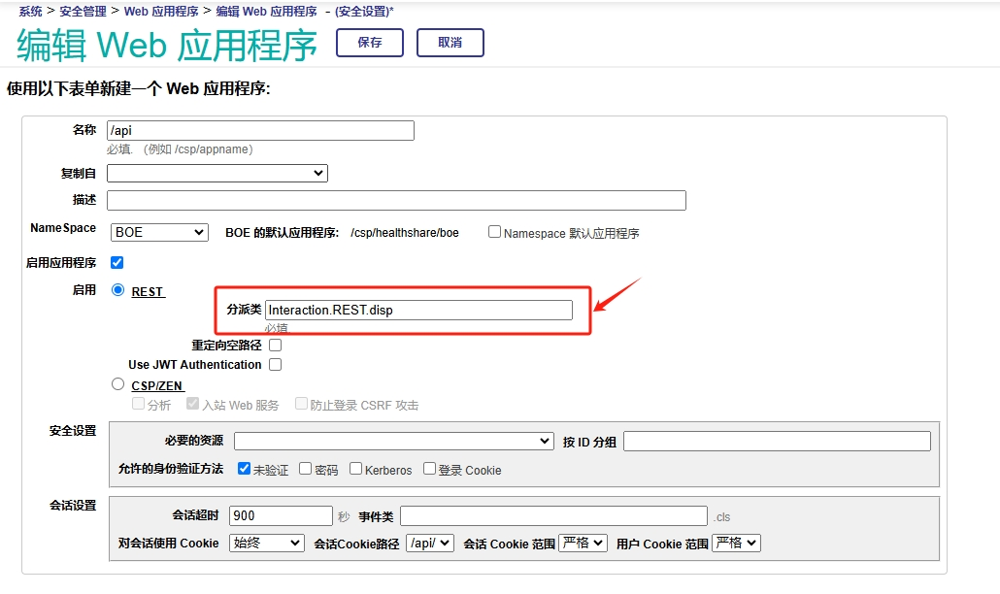

# 服务交互

## 1 使用JSON指南

**`Interaction.Json`**

```java
Class Interaction.Json Extends (%RegisteredObject, %JSON.Adaptor)
{

/// JSON Object
ClassMethod JSONObject()
{
	/* 创建动态实例 */
	s person = {} //s person = ##class(%DynamicObject).%New()
	s person.Relationships = [] //s person.Relationships = ##class(%DynamicArray).%New()

	s person.IDNum = "342622199304055257" //d person.%Set("IDNum", "342622199304055257")
	s person.Name = "wanyh" 

	s Relationship = {}
    s Relationship.Relation = "father"
    s Relationship.Name = "wanxw"
	d person.Relationships.%Push(Relationship)
	
	s Relationship = {}
    s Relationship.Relation = "mother"
    s Relationship.Name = "tonggx"
	d person.Relationships.%Push(Relationship)

	/* 动态实例转为JSON字符串 */
	s jsonPerson = person.%ToJSON()
	w jsonPerson,!
	s jsonPersonStream = ##class(%Stream.GlobalCharacter).%New()
	d person.%ToJSON(jsonPersonStream)
	#; {"Relationships":[{"Relation":"father","Name":"wanxw"},{"Relation":"mother","Name":"tonggx"}],"IDNum":"342622199304055257","Name":"wanyh"}
	
	/* JSON字符串转为动态实例 */
	s person = {}.%FromJSON(jsonPerson)
	zw person
	s person = {}.%FromJSON(jsonPersonStream.ReadLineIntoStream())
	#; person={"Relationships":[{"Relation":"father","Name":"wanxw"},{"Relation":"mother","Name":"tonggx"}],"IDNum":"342622199304055257","Name":"wanyh"}  ; <DYNAMIC OBJECT>
	
	/* 解析动态实例 */
	w "IDNum:"_person.IDNum,! //w "IDNum:"_person.%Get("IDNum"),!
	w "Name:"_person.Name,!
	
	s itr = person.Relationships.%GetIterator()
	while itr.%GetNext(.key, .val){
		w "Relation:"_val.Relation,!
		w "Name:"_val."Name",!
	}
	#; IDNum:342622199304055257
	#; Name:wanyh
	#; Relation:father
	#; Name:wanxw
	#; Relation:mother
	#; Name:tonggx
}

/// %JSON.Adaptor
ClassMethod JSONAdaptor()
{
	/* 创建对象 */
	s person = ##class(Interaction.Models.Person).%New()
	s person.IDCard = "342622199304055257"
	s person.Name = "wanyh"
	
	s Relationship = ##class(Interaction.Models.Relationship).%New()
	s Relationship.Relation = "father"
	s Relationship.Name = "wanxw"
	d person.Relationships.Insert(Relationship)

	s Relationship = ##class(Interaction.Models.Relationship).%New()
	s Relationship.Relation = "mother"
	s Relationship.Name = "tonggx"
	d person.Relationships.Insert(Relationship)
	
	/* 对象导出为JSON字符串 */
	d person.%JSONExportToString(.jsonPerson)
	w jsonPerson,!
	d person.%JSONExportToStream(.jsonStreamPerson)
	#; {"IDNum":"342622199304055257","Name":"wanyh","Relationships":[{"Relation":"father","Name":"wanxw"},{"Relation":"mother","Name":"tonggx"}]}
	
	/* JSON字符串导入对象 */
	s person = ##class(Interaction.Models.Person).%New()
	d person.%JSONImport(jsonPerson)
	
	/* 解析JSON对象 */ 
	w "IDNum:"_person.IDCard,!
	w "Name:"_person.Name,!

	while person.Relationships.GetNext(.key){
		w "Relation:"_person.Relationships.GetAt(key).Relation,!
		w "Name:"_person.Relationships.GetAt(key).Name,! 
	}
	
	#; IDNum:342622199304055257
	#; Name:wanyh
	#; Relation:father
	#; Name:wanxw
	#; Relation:mother
	#; Name:tonggx
}

}
```

**`Interaction.Models.Person`**

```java
Class Interaction.Models.Person Extends (%RegisteredObject, %XML.Adaptor, %JSON.Adaptor)
{

/// Person's IDCard number.
Property IDCard As %String;

/// Name of the person.
Property Name As %String;

/// Person's Relationships.
Property Relationships As list Of Interaction.Models.Relationship;

}
```

**`Interaction.Models.Relationship`**

```java
Class Interaction.Models.Relationship Extends (%RegisteredObject, %XML.Adaptor, %JSON.Adaptor)
{

/// Relation description.
Property Relation As %String;

/// Name of the person.
Property Name As %String;

}
```


## 2 创建REST服务

### 2.1 OpenAPI 2.0规范创建REST服务示例

**1. 生成服务类：`/api/mgmnt`**

`http://localhost:52773/api/mgmnt/v2/boe/notes.RESTful.AutoApp?IRISUsername=_system&IRISPassword=SYS`


**2. 应用程序：`/api/autoapp`**


**规范类：`Interaction.REST.AutoApp.spec`**

```java
Class Interaction.REST.AutoApp.spec Extends %REST.Spec [ ProcedureBlock ]
{

XData OpenAPI [ MimeType = application/json ]
{
{
  "info":{
    "title":"",
    "description":"",
    "version":"",
    "x-ISC_Namespace":"boe"
  },
  "basePath":"/api/autoapp",
  "paths":{
    "/resource":{
      "get":{
        "operationId":"GetResourceById",
        "description":" GET http://localhost:52773/api/autoapp/resource ",
        "x-ISC_ServiceMethod":"GetResourceById",
        "responses":{
          "default":{
            "description":"(Unexpected Error)"
          },
          "200":{
            "description":"(Expected Result)"
          }
        }
      },
      "post":{
        "operationId":"CreateResource",
        "description":" POST http://localhost:52773/api/autoapp/resource ",
        "x-ISC_ServiceMethod":"CreateResource",
        "parameters":[
          {
            "name":"payloadBody",
            "in":"body",
            "description":"Request body contents",
            "required":false,
            "schema":{
              "type":"string"
            }
          }
        ],
        "responses":{
          "default":{
            "description":"(Unexpected Error)"
          },
          "200":{
            "description":"(Expected Result)"
          }
        }
      }
    }
  },
  "swagger":"2.0"
}
}

}
```

**分派类：`Interaction.REST.AutoApp.disp`**

```java
/// Dispatch class defined by RESTSpec in notes.RESTful.AutoApp.spec
Class Interaction.REST.AutoApp.disp Extends %CSP.REST [ GeneratedBy = Interaction.REST.AutoApp.spec.cls, ProcedureBlock ]
{

/// The class containing the RESTSpec which generated this class
Parameter SpecificationClass = "Interaction.REST.AutoApp.spec";

/// Ignore any writes done directly by the REST method.
Parameter IgnoreWrites = 1;

/// By default convert the input stream to Unicode
Parameter CONVERTINPUTSTREAM = 1;

/// The default response charset is utf-8
Parameter CHARSET = "utf-8";

XData UrlMap [ XMLNamespace = "http://www.intersystems.com/urlmap" ]
{
<Routes>
  <Route Url="/resource" Method="get" Call="GetResourceById" />
  <Route Url="/resource" Method="post" Call="CreateResource" />
</Routes>
}

ClassMethod GetResourceById() As %Status
{
    Try {
        Set response=##class(Interaction.REST.AutoApp.impl).GetResourceById()
        Do ##class(Interaction.REST.AutoApp.impl).%WriteResponse(response)
    } Catch (ex) {
        Do ##class(%REST.Impl).%ReportRESTError(..#HTTP500INTERNALSERVERERROR,ex.AsStatus(),$parameter("Interaction.REST.AutoApp.impl","ExposeServerExceptions"))
    }
    Quit $$$OK
}

ClassMethod CreateResource() As %Status
{
    Try {
        If $isobject(%request.Content) Set ppayloadBody=%request.Content
        Set response=##class(Interaction.REST.AutoApp.impl).CreateResource(.ppayloadBody)
        Do ##class(Interaction.REST.AutoApp.impl).%WriteResponse(response)
    } Catch (ex) {
        Do ##class(%REST.Impl).%ReportRESTError(..#HTTP500INTERNALSERVERERROR,ex.AsStatus(),$parameter("Interaction.REST.AutoApp.impl","ExposeServerExceptions"))
    }
    Quit $$$OK
}

}
```

**实现类：`Interaction.REST.AutoApp.impl`**

```java
/// Business logic class defined by OpenAPI in notes.RESTful.AutoApp.spec<br/>
/// Updated Oct 15, 2024 10:49:50
Class Interaction.REST.AutoApp.impl Extends %REST.Impl [ ProcedureBlock ]
{

/// If ExposeServerExceptions is true, then details of internal errors will be exposed.
Parameter ExposeServerExceptions = 0;

/// GET http://localhost:52773/api/autoapp/resource
ClassMethod GetResourceById() As %Stream.Object
{
    //(Place business logic here)
    //Do ..%SetStatusCode(<HTTP_status_code>)
    //Do ..%SetHeader(<name>,<value>)
    //Quit (Place response here) ; response may be a string, stream or dynamic object
    Try {
	    s Id = %request.Data("Id",1)
        #; ...
	    return {"message": "success"}
    } Catch (ex) {
        d ##class(%REST.Impl).%SetStatusCode("500")
        return {"errormessage": "Server error"}
   }
}

/// POST http://localhost:52773/api/autoapp/resource<br/>
/// The method arguments hold values for:<br/>
///     payloadBody, Request body contents<br/>
ClassMethod CreateResource(payloadBody As %Stream.Object) As %Stream.Object
{
    //(Place business logic here)
    //Do ..%SetStatusCode(<HTTP_status_code>)
    //Do ..%SetHeader(<name>,<value>)
    //Quit (Place response here) ; response may be a string, stream or dynamic object
    Try {
	    s tObj = {}.%FromJSON(payloadBody)
        #; ...
	    return {"message": "success"}

    } Catch (ex) {
        d ##class(%REST.Impl).%SetStatusCode("500")
        return {"errormessage": "Server error"}
   }
}

}
```

### 2.2 手动创建REST服务示例

**1. 应用程序：`/api`**




**2. 分派类：`Interaction.REST.disp` `Interaction.REST.ManualApp.disp`**

**`Interaction.REST.disp`**

```java
/// 总分发类
Class Interaction.REST.disp Extends %CSP.REST
{

Parameter HandleCorsRequest = 0;

XData UrlMap [ XMLNamespace = "https://www.intersystems.com/urlmap" ]
{
<Routes>
	<Map Prefix="/manualapp" Forward="Interaction.REST.ManualApp.disp"/>
</Routes>
}

}
```

**`Interaction.REST.ManualApp.disp`**

```java
/// 分发类
Class Interaction.REST.ManualApp.disp Extends %CSP.REST
{

Parameter HandleCorsRequest = 0;

XData UrlMap [ XMLNamespace = "https://www.intersystems.com/urlmap" ]
{
<Routes>
	 <Route Url = "/resource" Method = "GET" Call = "GetResourceById" />
	 <Route Url = "/resource" Method = "POST" Call = "CreateResource" />
</Routes>
}

/// GET http://localhost:52773/api/manualapp/resource
ClassMethod GetResourceById() As %Status
{
    Try {
        d ##class(%REST.Impl).%SetContentType("application/json")
        if '##class(%REST.Impl).%CheckAccepts("application/json"){
	    	d ##class(%REST.Impl).%ReportRESTError(..#HTTP406NOTACCEPTABLE, $$$ERROR($$$RESTBadAccepts))
	    	q  
	    }

        // 鉴权
        // 1. 获取标头
        s AK = %request.GetCgiEnv("HTTP_AK","")
        s UUID = %request.GetCgiEnv("HTTP_UUID", "")
        s Timestamp = %request.GetCgiEnv("HTTP_TIMESTAMP", "")
        s Sign = %request.GetCgiEnv("HTTP_SIGN", "")

        // 2. 生成本地Sign对比
        s SK = "rIacv39f8gZ5lH7ZMZ"
        s text = "ak="_AK_"sk="_SK_"timestamp="_Timestamp_"uuid="_UUID 
        s localSign = ..MD5HexStr(text)
        s tSC = ..CompareSign(localSign, Sign)

        if tSC '= $$$OK {
            s response = {"message": "鉴权失败"}
        }else {
            s response = ##class(Interaction.REST.ManualApp.impl).GetResourceById()
        }
    } Catch (ex) {
        d ##class(%REST.Impl).%SetStatusCode("400")
        s response =  {"errormessage": "Client error"}
    }
    d ##class(%REST.Impl).%WriteResponse(response)
    q $$$OK
}

/// POST http://localhost:52773/api/manualapp/resource
ClassMethod CreateResource() As %Status
{
    Try {
        d ##class(%REST.Impl).%SetContentType("application/json")
        if '##class(%REST.Impl).%CheckAccepts("application/json"){
	    	d ##class(%REST.Impl).%ReportRESTError(..#HTTP406NOTACCEPTABLE, $$$ERROR($$$RESTBadAccepts))
	    	q  
	    }

         // 鉴权
        // 1. 获取标头
        s AK = %request.GetCgiEnv("HTTP_AK","")
        s UUID = %request.GetCgiEnv("HTTP_UUID", "")
        s Timestamp = %request.GetCgiEnv("HTTP_TIMESTAMP", "")
        s Sign = %request.GetCgiEnv("HTTP_SIGN", "")

        // 2. 生成本地Sign对比
        s SK = "rIacv39f8gZ5lH7ZMZ"
        s text = "ak="_AK_"sk="_SK_"timestamp="_Timestamp_"uuid="_UUID 
        s localSign = ..MD5HexStr(text)
        s tSC = ..CompareSign(localSign, Sign)

        if tSC '= $$$OK {
            s response = {"message": "鉴权失败"}
        }else {
             if $isobject(%request.Content) s ppayloadBody=%request.Content
            s response = ##class(Interaction.REST.ManualApp.impl).CreateResource(.ppayloadBody)
            
        }
    } Catch (ex) {
        d ##class(%REST.Impl).%SetStatusCode("400")
        s response =  {"errormessage": "Client error"}
    }
    d ##class(%REST.Impl).%WriteResponse(response)
    q $$$OK
}

/// MD5加密并转成16进制字符
ClassMethod MD5HexStr(val As %String)
{
	s ret = ""
	q:val="" ""
	s enc = ##class(%SYSTEM.Encryption).MD5Hash(val)
	f j = 1 : 1 : $l(enc) d
	.s ascii = $a($e(enc,j)) 
	.if ascii < 16 s ret = ret_"0"_$zh(ascii)
	.else  s ret = ret_$zh(ascii)
	q ret
}

/// 比较本地生成的sign和入参获取到的sign是否一致
ClassMethod CompareSign(localSign As %String, otherSign As %String) As %Status
{
	s localSign = $ZCONVERT(localSign, "U")
	s otherSign = $ZCONVERT(otherSign, "U")
	q localSign = otherSign
}

}
```

**3. 实现类：`Interaction.REST.ManualApp.impl`**

```java
/// 实现类
Class Interaction.REST.ManualApp.impl Extends %CSP.REST
{

ClassMethod GetResourceById() As %DynamicObject
{
    Try {
	    s Id = %request.Data("Id",1)
        #; ...
	    return {"message": "success"}
    } Catch (ex) {
        d ##class(%REST.Impl).%SetStatusCode("500")
        return {"errormessage": "Server error"}
   }
}

ClassMethod CreateResource(payloadBody As %Stream.Object) As %DynamicObject
{
    Try {
	    s tObj = {}.%FromJSON(payloadBody)
        #; ...
	    return {"message": "success"}

    } Catch (ex) {
        d ##class(%REST.Impl).%SetStatusCode("500")
        return {"errormessage": "Server error"}
   }
}

}
```


## 3 发送HTTP请求

**`Interaction.REST.Calling`**

```java
Class Interaction.REST.Calling Extends %RegisteredObject
{

/// Sending HTTP Request
ClassMethod SendHttpRequest()
{
	/* 创建%Net.HttpRequest的实例，设置实例属性 */
    s request = ##class(%Net.HttpRequest).%New()
	s request.Server = "localhost" //IP
	s request.Port = "52773" //端口
	s request.Location = "/api/manualapp/resource" //地址
	s request.Timeout = 3 //等待超时

	/* 认证标头*/
	s AK 		= "BOE"
	s SK 		= "rIacv39f8gZ5lH7ZMZ"
	s UUID 		= ##class(%SYSTEM.Util).CreateGUID()
	s Timestamp	= ..GetUNIXTimeStamp()
	s text 		= "ak="_AK_"sk="_SK_"timestamp="_Timestamp_"uuid="_UUID
	s Sign 		= ..MD5HexStr(text)
	d request.SetHeader("AK",AK)
	d request.SetHeader("UUID",UUID)
	d request.SetHeader("Timestamp",Timestamp)
	d request.SetHeader("Sign",Sign)

	#; /* 发送HTTP GET请求 */
	#; d request.InsertParam("Id", 1) //插入参数
	#; s status = request.Get()

	/* 发送HTTP POST请求 */
	d request.EntityBody.SetAttribute("CONTENT-TYPE","application/json")  //请求主体
	s jsonStream = ##class(%Stream.GlobalCharacter).%New()
	s jsonObj = {}
	s jsonObj.Id = "1"
	d jsonObj.%ToJSON(jsonStream) 
	d request.EntityBody.CopyFrom(jsonStream)
	s status = request.Post()
    
  #; /* 发送HTTP DELETE请求 */
	#; s status = request.Send("DELETE")

	/* 接收HTTP响应 */
	if $$$ISERR(status){
		w $system.Status.GetErrorText(status) ,!
	}else{
		s response = request.HttpResponse
		s statusCode = response.StatusCode
		s data = response.Data
		s dataObj = {}.%FromJSON(data)
		w dataObj.message ,!
	}
	
	/* Others */
	#; d request.InsertFormData("Id","1") //表单

	#; s request.Https=1 //https连接
	#; s request.Port=443
	#; s request.SSLConfiguration="MySSLConfiguration"
	#; s request.SSLCheckServerIdentity = 0 //禁用SSL证书检查
	
	#; s request.Username="10695144-4GA075FF" //认证方式1
	#; s request.Password="welcome1"
	#; d request.SetHeader("Authorization",token) //认证方式2  //设置标头
}

/// MD5加密并转成16进制字符
ClassMethod MD5HexStr(val As %String)
{
	s ret = ""
	q:val="" ""
	s enc = ##class(%SYSTEM.Encryption).MD5Hash(val)
	f j = 1 : 1 : $l(enc) d
	.s ascii = $a($e(enc,j)) 
	.if ascii < 16 s ret = ret_"0"_$zh(ascii)
	.else  s ret = ret_$zh(ascii)
	q ret
}

/// Description : 获取当前Unix时间戳
/// Input		: aMillisecond是否携带毫秒
ClassMethod GetUNIXTimeStamp(aMillisecond As %Integer = 0) As %Integer
{
	s return=""
	s TimeStamp = $ZTIMESTAMP	//毫秒级内部时间戳(UTC)
	
	s date = $p(TimeStamp,",",1)		//日期
	s tmpTime = $e(TimeStamp,$l(date)+2,$l(TimeStamp))
	s tmpTime = $fn(tmpTime,"",3)		//毫秒尾数为0时会隐藏
	s time = $p(tmpTime,".",1)		//时间
	s millisecond = $p(tmpTime,".",2)	//毫秒
	//转时区(UTC+8)
	s time = time + (8*3600)
	if (time > 86400) {
		s date = date + 1
		s time = time - 86400
	}
	//Unix时间戳是从1970-01-01开始，M时间从1841-01-01
	s Difference = 4070937600		//固定时间差
	s return = (date * 24 * 3600) + time - Difference
	s:aMillisecond=1 return = return_millisecond
	q return
}

}
```


## 4 使用XML指南

**`Interaction.XM`**

```java
Class Interaction.XML Extends (%RegisteredObject, %XML.Adaptor)
{

/// %XML.Writer
ClassMethod XMLWrite()
{
	s obj = ##class(Interaction.Models.Person).%New()
	s obj.IDCard = "340124202003054873"
	s obj.Name = "wansk"
	s rObj = ##class(Interaction.Models.Relationship).%New()
	s rObj.Name = "wanyh"
	s rObj.Relation = "father"
	d obj.Relationships.Insert(rObj)
	s rObj = ##class(Interaction.Models.Relationship).%New()
	s rObj.Name = "lumia"
	s rObj.Relation = "mother"
	d obj.Relationships.Insert(rObj)

	//1. 对象写入XML输出
	// 创建实例
	s writer = ##class(%XML.Writer).%New()
	s writer.Indent = 1 //设置缩进
	
	// 读取对象
	#;	d writer.OutputToString()
	#;	d writer.RootObject(obj)
	#;	s xml = writer.GetXMLString()
	#;	w xml ,!
	s stream = ##class(%Stream.GlobalCharacter).%New()
	s status = writer.OutputToStream(.stream)
	i $$$ISERR(status) {d $System.Status.DisplayError(status) q}
	s status = writer.RootObject(obj)
	i $$$ISERR(status) {d $System.Status.DisplayError(status) q}
	w stream.Read() ,!

	// XMLExportToStream
	#;	d obj.XMLExportToStream(.Stream)
	
	//2. 手动编写XML输出
	set xml=##class(%XML.Writer).%New()
	s xml.Indent = 1
	d xml.OutputToStream(.stream)
	d xml.RootElement("Person")
		d xml.Element("IDCard"), xml.Write("340124202003054873") ,xml.EndElement()
		d xml.Element("Name"), xml.Write("wansk") ,xml.EndElement()
		d xml.Element("Relationships")
			d xml.Element("Relationship")
				d xml.Element("Relation"), xml.Write("father") ,xml.EndElement()
				d xml.Element("Name"), xml.Write("wanyh") ,xml.EndElement()
			d xml.EndElement()
			d xml.Element("Relationship")
				d xml.Element("Relation"), xml.Write("mother") ,xml.EndElement()
				d xml.Element("Name"), xml.Write("lumina") ,xml.EndElement()
			d xml.EndElement()
		d xml.EndElement()
	d xml.EndRootElement()
	w stream.Read() ,!
}

/// %XML.Reader
ClassMethod XMLReader()
{
	s str =			"<Person>"
	s str =	str _		"<IDCard>340124202003054873</IDCard>"			
	s str =	str _		"<Name>wansk</Name>"
    s str =	str _		"<Relationships>"
    s str =	str _			"<Relationship>"
    s str =	str _				"<Relation>father</Relation>"
    s str =	str _				"<Name>wanyh</Name>"
    s str =	str _			"</Relationship>"
    s str =	str _			"<Relationship>"
    s str =	str _				"<Relation>mother</Relation>"
    s str =	str _				"<Name>lumina</Name>"
    s str =	str _			"</Relationship>"
    s str =	str _		"</Relationships>"
	s str =	str _	"</Person>"
	
	#; 1. XMLReader
	// 创建实例,导入XML
	s reader = ##class(%XML.Reader).%New()
	s status = reader.OpenString(str)
	#; status = reader.OpenStream(Stream)
	i $$$ISERR(status) {d $System.Status.DisplayError(status) q}
	
	// 将XML导入对象
	d reader.CorrelateRoot("Interaction.Models.Person")
	d reader.Next(.object, .status)
	i $$$ISERR(status) {d $System.Status.DisplayError(status) q}
	
	w "IDCard：", object.IDCard ,!
	w "Name：",  object.Name ,!
	w "RelationshipCount：",  object.Relationships.Count() ,!
	for i = 1 : 1 : object.Relationships.Count() {
		w "Relation:"_object.Relationships.GetAt(i).Relation ,!
		w "Name:"_object.Relationships.GetAt(i).Name ,!
	}
	
	#; 2. %XML.XPATH.Document
	s tSC = ##class(%XML.XPATH.Document).CreateFromString(str,.tDocument)
	#; s tSC = ##class(%XML.XPATH.Document).CreateFromStream(Input,.tDocument)
	i $$$ISERR(tSC) {d $System.Status.DisplayError(tSC) q}
	s tSC = tDocument.EvaluateExpression("/Person/IDCard","text()",.tRes)
	if ($$$ISOK(tSC) && (tRes.GetAt(1) '= "")){    
    	s fieldValue = tRes.GetAt(1).Value
    	s IDCard = $tr(fieldValue,$c(0),"")
    	w "IDCard：", IDCard ,!
   	}
   	s tSC = tDocument.EvaluateExpression("/Person/Name","text()",.tRes)
	if ($$$ISOK(tSC) && (tRes.GetAt(1) '= "")){    
    	s fieldValue = tRes.GetAt(1).Value
    	s Name = $tr(fieldValue,$c(0),"")
    	w "Name：", Name ,!
   	}
   	
   	s tSC = tDocument.EvaluateExpression("/Person/Relationships","count(Relationship)",.tRes)
   	if ($$$ISOK(tSC) && (tRes.GetAt(1) '= "")){
 		s hsCount = tRes.GetAt(1).Value
 		w "RelationshipCount：", hsCount ,!
		for i = 1 : 1 : hsCount {
			s tSC = tDocument.EvaluateExpression("/Person/Relationships/Relationship["_i_"]/Relation","text()",.tRes)                    
			if ($$$ISOK(tSC) && (tRes.GetAt(1) '= "")){    
         		s fieldValue = tRes.GetAt(1).Value
         		s Relation = $tr(fieldValue,$c(0),"")
      			w "Relation：", Relation ,!
       		} 
      		s tSC = tDocument.EvaluateExpression("/Person/Relationships/Relationship["_i_"]/Name","text()",.tRes)                    
    		if ($$$ISOK(tSC) && (tRes.GetAt(1) '= "")){    
        		s fieldValue = tRes.GetAt(1).Value
      			s Name = $tr(fieldValue,$c(0),"")
            	w "Name：", Name ,!
        	} 
    	}
   	}
}

}
```

**`Interaction.Models.Person`**

```java
Class Interaction.Models.Person Extends (%RegisteredObject, %XML.Adaptor, %JSON.Adaptor)
{

/// Person's IDCard number.
Property IDCard As %String;

/// Name of the person.
Property Name As %String;

/// Person's Relationships.
Property Relationships As list Of Interaction.Models.Relationship;

}
```

**`Interaction.Models.Relationship`**

```java
Class Interaction.Models.Relationship Extends (%RegisteredObject, %XML.Adaptor, %JSON.Adaptor)
{

/// Relation description.
Property Relation As %String;

/// Name of the person.
Property Name As %String;

}
```


## 5 Web服务和客户端

### 5.1 发布Web服务

要访问SOAP测试页面，需切换至%SYS命名空间，运行:

```java
set ^SYS("Security","CSP","AllowClass","/csp/healthshare/boe/services/","%SOAP.WebServiceInfo")=1

set ^SYS("Security","CSP","AllowClass","/csp/healthshare/boe/services/","%SOAP.WebServiceInvoke")=1
```

命名空间下Web服务的应用程序：/csp/healthshare/boe/services

**`Interaction.SOAP.Service`**

```java
/// http://localhost:52773/csp/healthshare/boe/services/Interaction.SOAP.Service.cls?WSDL
Class Interaction.SOAP.Service Extends %SOAP.WebService
{

/// Name of the WebService.
Parameter SERVICENAME = "DivService";

/// TODO: change this to actual SOAP namespace.
/// SOAP Namespace for the WebService
Parameter NAMESPACE = "https://temuri.org";

/// Namespaces of referenced classes will be used in the WSDL.
Parameter USECLASSNAMESPACES = 1;

Method Div(Input1 As %String, Input2 As %String) As %String [ WebMethod ]
{
    // 获取自定义标头值
    s AK = ..HeadersIn.GetAt("Security").AK
	s UUID = ..HeadersIn.GetAt("Security").UUID
	s Timestamp = ..HeadersIn.GetAt("Security").Timestamp
	s Sign = ..HeadersIn.GetAt("Security").Sign

    // 生成本地Sign对比
    s SK = "rIacv39f8gZ5lH7ZMZ"
    s text = "ak="_AK_"sk="_SK_"timestamp="_Timestamp_"uuid="_UUID 
	s localSign = ..MD5HexStr(text)
    s tSC = ..CompareSign(localSign, Sign)
    if tSC '= $$$OK Quit "鉴权失败"
    
    q Input1_" / "_Input2_" = "_(Input1 / Input2)
}

/// MD5加密并转成16进制字符
ClassMethod MD5HexStr(val As %String)
{
	s ret = ""
	q:val="" ""
	s enc = ##class(%SYSTEM.Encryption).MD5Hash(val)
	f j = 1 : 1 : $l(enc) d
	.s ascii = $a($e(enc,j)) 
	.if ascii < 16 s ret = ret_"0"_$zh(ascii)
	.else  s ret = ret_$zh(ascii)
	q ret
}

/// 比较本地生成的sign和入参获取到的sign是否一致
ClassMethod CompareSign(localSign As %String, otherSign As %String) As %Status
{
	s localSign = $ZCONVERT(localSign, "U")
	s otherSign = $ZCONVERT(otherSign, "U")
	q localSign = otherSign
}

/// 添加自定义消息头
XData AddHeader
{
<parameters xmlns="http://www.intersystems.com/configuration">
   <request>
      <header name="Security" class="Interaction.SOAP.Header"/> 
   </request>
</parameters>
}

}
```

**`Interaction.SOAP.Header`**

```java
/// 自定义加密服务消息头
Class Interaction.SOAP.Header Extends %SOAP.Header
{

Parameter NAMESPACE = "https://temuri.org";

Parameter XMLNAME = "Security";

/// 用户名
Property AK As %String;

/// UUID
Property UUID As %String;

/// 时间戳
Property Timestamp As %String;

/// Sign
Property Sign As %String;

}
```

### 5.2 使用Web客户端

**1. 创建web客户端**

```java
Class Interaction.SOAP.Calling Extends %RegisteredObject
{

/// Create SOAPClient
ClassMethod CreateClient()
{
	s r = ##class(%SOAP.WSDL.Reader).%New()
	#; s r.SSLCheckServerIdentity = 0 // 禁用SSL证书检查
	s url = "http://localhost:52773/csp/healthshare/boe/services/Interaction.SOAP.Service.cls?WSDL"
	s package = "Interaction.SOAP.Client"
	s status = r.Process(url, package)
	i $$$ISERR(status) {d $System.Status.DisplayError(status) q}
}
    
}
```

生成的客户端类：

**`Interaction.SOAP.Client.DivServiceSoap`**

```java
Class Interaction.SOAP.Client.DivServiceSoap Extends %SOAP.WebClient [ ProcedureBlock ]
{

/// This is the URL used to access the web service.
Parameter LOCATION = "http://localhost:52773/csp/healthshare/boe/services/Interaction.SOAP.Service.cls";

/// This is the namespace used by the Service
Parameter NAMESPACE = "https://temuri.org";

/// This is the name of the Service
Parameter SERVICENAME = "DivService";

/// This is the SOAP version supported by the service.
Parameter SOAPVERSION = 1.1;

Method Div(Input1 As %String, Input2 As %String) As %String [ Final, ProcedureBlock = 1, SoapBindingStyle = document, SoapBodyUse = literal, WebMethod ]
{
 Quit ..WebMethod("Div").Invoke($this,"https://temuri.org/Interaction.SOAP.Service.Div",.Input1,.Input2)
}

XData parameters
{
<parameters xmlns="http://www.intersystems.com/configuration" xmlns:cfg="http://www.intersystems.com/configuration">
  <method name="Div">
    <request>
      <header name="Security" class="Interaction.SOAP.Client.Security"/>
    </request>
  </method>
</parameters>
}

}
```

**`Interaction.SOAP.Client.Security`**

```java
Class Interaction.SOAP.Client.Security Extends %SOAP.Header [ ProcedureBlock ]
{

Parameter XMLFORMAT = "literal";

Parameter XMLNAME = "Security";

Parameter XMLSEQUENCE = 1;

Property AK As %String(MAXLEN = "", XMLNAME = "AK");

Property UUID As %String(MAXLEN = "", XMLNAME = "UUID");

Property Timestamp As %String(MAXLEN = "", XMLNAME = "Timestamp");

Property Sign As %String(MAXLEN = "", XMLNAME = "Sign");

}
```

**2. 使用web客户端**

```java
Class Interaction.SOAP.Calling Extends %RegisteredObject
{

/// Using SOAPClient
ClassMethod UsingClient()
{
	s $ze = ""
	s client = ##class(Interaction.SOAP.Client.DivServiceSoap).%New()
	#; s client.Location = "url" // 替换
	#; s client.SSLConfiguration = "SSL" // SSL证书
	#; s client.SSLCheckServerIdentity = "0" // 禁用SSL证书检查

	// 赋值自定义标头值
	s securityHeader = ##class(Interaction.SOAP.Client.Security).%New()
	s AK 		= "BOE"
	s SK 		= "rIacv39f8gZ5lH7ZMZ"
	s UUID 		= ##class(%SYSTEM.Util).CreateGUID()
	s Timestamp	= ..GetUNIXTimeStamp()
	s text 		= "ak="_AK_"sk="_SK_"timestamp="_Timestamp_"uuid="_UUID
	s Sign 		= ..MD5HexStr(text)
	
	s securityHeader.AK 		= AK
	s securityHeader.UUID 		= UUID
	s securityHeader.Timestamp 	= Timestamp
	s securityHeader.Sign 		= Sign

 	d client.HeadersOut.SetAt(securityHeader, "Security")

	s client.Timeout = 3 //超时时间 默认30s

	try {
		s ans = client.Div(5, 2)
	} catch {
		if $ze["<ZSOAP>" {
			// 如果 SOAP 错误, $ZERROR的值以<ZSOAP>开头, 并且%objlasterror包含由接收到的 SOAP 错误
    		s ans = %objlasterror
		} else {
            s ans = $$$ERROR($$$ObjectScriptError,$ze)
        }
	}
	q ans
}

/// MD5加密并转成16进制字符
ClassMethod MD5HexStr(val As %String)
{
	s ret = ""
	q:val="" ""
	s enc = ##class(%SYSTEM.Encryption).MD5Hash(val)
	f j = 1 : 1 : $l(enc) d
	.s ascii = $a($e(enc,j)) 
	.if ascii < 16 s ret = ret_"0"_$zh(ascii)
	.else  s ret = ret_$zh(ascii)
	q ret
}

/// Description : 获取当前Unix时间戳
/// Input		: aMillisecond是否携带毫秒
ClassMethod GetUNIXTimeStamp(aMillisecond As %Integer = 0) As %Integer
{
	s return=""
	s TimeStamp = $ZTIMESTAMP	//毫秒级内部时间戳(UTC)
	
	s date = $p(TimeStamp,",",1)		//日期
	s tmpTime = $e(TimeStamp,$l(date)+2,$l(TimeStamp))
	s tmpTime = $fn(tmpTime,"",3)		//毫秒尾数为0时会隐藏
	s time = $p(tmpTime,".",1)		//时间
	s millisecond = $p(tmpTime,".",2)	//毫秒
	//转时区(UTC+8)
	s time = time + (8*3600)
	if (time > 86400) {
		s date = date + 1
		s time = time - 86400
	}
	//Unix时间戳是从1970-01-01开始，M时间从1841-01-01
	s Difference = 4070937600		//固定时间差
	s return = (date * 24 * 3600) + time - Difference
	s:aMillisecond=1 return = return_millisecond
	q return
}

}
```

**3. 打开SOAP日志记录**

设置该命名空间中的`^ISCSOAP`全局节点：

```java
 Set ^ISCSOAP("LogFile")=filename
 Set ^ISCSOAP("Log")=optionString
 Set ^ISCSOAP("LogMaxFileSize")=optionalMaxLogSize
```

设置其他节点来进一步微调记录的内容：

```java
 Set ^ISCSOAP("LogURL",optionalUrlMatch)=""
 Set ^ISCSOAP("LogJob",optionalJobId)=""
 Set ^ISCSOAP("LogClass",optionalClassname)=""
```

filename：创建的日志文件的完整路径和文件名

optionString：**i** — 记录传入消息；**o** — 记录出站消息；**s** — 记录安全信息；**h** — 仅记录 SOAP 标头；**H** — 记录 HTTP 标头。例如：**“iosh”**

optionalMaxLogSize：日志文件的最大大小（以字节为单位）

optionalUrlMatch：指定要匹配的 URL 模式，可以包含前导 * 通配符、尾随 * 通配符或两者

optionalJobId：进程ID，Web 客户端进程 或 运行 Web 服务的 Web 网关进程 或 production进程

optionalClassname：Web 服务或客户端类的名称

## 6  互操作性产品

一个集成框架，用于轻松连接系统和开发互操作性应用程序：

- 提供与各种消息格式和通信协议的内置连接；
- 提供消息的持久存储，可以跟踪消息的路径并审核消息是否成功传递。

产品由业务服务、流程和操作组成：

- 业务服务(Business services)与外部系统连接并从它们接收消息；
- 业务流程(Business processes)允许定义业务逻辑，包括路径和消息转换；
- 业务操作(Business operations)与外部系统连接并向其发送消息。


### 6.1 作业(Production)

```java
Class Interaction.Production.Production Extends Ens.Production
{

XData ProductionDefinition
{
<Production Name="Interaction.Production.Production" TestingEnabled="true" LogGeneralTraceEvents="false">
  <Description></Description>
  <ActorPoolSize>2</ActorPoolSize>
  <Item Name="Interaction.Production.BS.SOAP" Category="" ClassName="Interaction.Production.BS.SOAP" PoolSize="0" Enabled="true" Foreground="false" Comment="" LogTraceEvents="false" Schedule="">
  </Item>
  <Item Name="Interaction.Production.BP.BP1" Category="" ClassName="Interaction.Production.BP.BP1" PoolSize="1" Enabled="true" Foreground="false" Comment="" LogTraceEvents="false" Schedule="">
  </Item>
  <Item Name="Interaction.Production.BO.SOAP" Category="" ClassName="Interaction.Production.BO.SOAP" PoolSize="1" Enabled="true" Foreground="false" Comment="" LogTraceEvents="false" Schedule="">
  </Item>
</Production>
}

}
```


### 6.2 消息(Messages)

**`Interaction.Production.Messages.Request`**

```java
Class Interaction.Production.Messages.Request Extends Ens.Request
{

/// 消息代码
Property MessageCode As %String;

/// 输入字符串
Property InputString As %String;

/// 输入字符流
Property InputStream As %Stream.GlobalCharacter;

Storage Default
{
<Data name="RequestDefaultData">
<Subscript>"Request"</Subscript>
<Value name="1">
<Value>MessageCode</Value>
</Value>
<Value name="2">
<Value>InputString</Value>
</Value>
<Value name="3">
<Value>InputStream</Value>
</Value>
</Data>
<DefaultData>RequestDefaultData</DefaultData>
<Type>%Storage.Persistent</Type>
}

}
```

**`Interaction.Production.Messages.Response`**

```java
Class Interaction.Production.Messages.Response Extends Ens.Response
{

/// 输出字符串
Property OutputString As %String;

/// 输出字符流
Property OutputStream As %Stream.GlobalCharacter;

Storage Default
{
<Data name="ResponseDefaultData">
<Subscript>"Response"</Subscript>
<Value name="1">
<Value>OutputString</Value>
</Value>
<Value name="2">
<Value>OutputStream</Value>
</Value>
</Data>
<DefaultData>ResponseDefaultData</DefaultData>
<Type>%Storage.Persistent</Type>
}

}
```


### 6.3 业务服务(Business services)

#### 6.3.1 SOAP

```java
/// http://localhost:52773/csp/healthshare/boe/services/Interaction.Production.BS.SOAP.cls?WSDL
Class Interaction.Production.BS.SOAP Extends EnsLib.SOAP.Service
{

Parameter ADAPTER;

Parameter NAMESPACE = "http://tempuri.org";

Parameter SERVICENAME = "SOAP";

Parameter USECLASSNAMESPACES = 1;

Method Send(Action As %String, pInput As %Stream.GlobalCharacter) As %Stream.GlobalCharacter [ WebMethod ]
{
    s pOutput = ##class(%Stream.GlobalCharacter).%New()

    // 鉴权认证
    s AK = ..HeadersIn.GetAt("Security").AK
	s UUID = ..HeadersIn.GetAt("Security").UUID
	s Timestamp = ..HeadersIn.GetAt("Security").Timestamp
	s Sign = ..HeadersIn.GetAt("Security").Sign

    s SK = "rIacv39f8gZ5lH7ZMZ" // 本地存储的SK
    s text = "ak="_AK_"sk="_SK_"timestamp="_Timestamp_"uuid="_UUID 
	s localSign = ..MD5HexStr(text)
    s tSC = ..CompareSign(localSign, Sign)
    if tSC'=$$$OK Quit "鉴权失败"
	s pInput = ##class(%Stream.GlobalCharacter).%New()
	d pInput.Write("输入流")

	s request = ##class(Interaction.Production.Messages.Request).%New()
	s request.MessageCode = Action
	s request.InputStream = pInput

	s tSc = ..SendRequestSync("Interaction.Production.BP.BP1",request,.tResponse) //同步调用
	//s tSC = ..SendRequestAsync("Interaction.Production.BP.BP1",request) //异步调用

	d pOutput.CopyFrom(tResponse.OutputStream)
	q pOutput
}

/// MD5加密并转成16进制字符
ClassMethod MD5HexStr(val As %String)
{
	s ret = ""
	q:val="" ""
	s enc = ##class(%SYSTEM.Encryption).MD5Hash(val)
	f j = 1 : 1 : $l(enc) d
	.s ascii = $a($e(enc,j)) 
	.if ascii < 16 s ret = ret_"0"_$zh(ascii)
	.else  s ret = ret_$zh(ascii)
	q ret
}

/// 比较本地生成的sign和入参获取到的sign是否一致
ClassMethod CompareSign(localSign As %String, otherSign As %String) As %Status
{
	s localSign = $ZCONVERT(localSign, "U")
	s otherSign = $ZCONVERT(otherSign, "U")
	q localSign = otherSign
}

/// 添加自定义消息头
XData AddHeader
{
<parameters xmlns="http://www.intersystems.com/configuration">
   <request>
      <header name="Security" class="Interaction.SOAP.Header"/> 
   </request>
</parameters>
}

}
```

#### 6.3.2 REST

```java
Class Interaction.Production.BS.REST Extends EnsLib.HTTP.Service
{

Parameter ADAPTER = "EnsLib.HTTP.InboundAdapter";

Method OnProcessInput(pStreamIn As %CharacterStream, Output pStreamOut As %CharacterStream) As %Status
{
    s request = ##class(Interaction.Production.Messages.Request).%New()
    s request.MessageCode = "REST"
    s request.InputStream = pStreamIn

    s tSc = ..SendRequestSync("Interaction.Production.BP.BP1",request,.tResponse) //同步调用
    //s tSC = ..SendRequestAsync("Interaction.Production.BP.BP1",request) //异步调用

    s pStreamOut = tResponse.OutputStream

	Quit $$$OK
}

}
```


### 6.4 业务流程(Business processes)


```java
Class Interaction.Production.BP.BP1 Extends Ens.BusinessProcessBPL
{

Storage Default
{
<Type>%Storage.Persistent</Type>
}

/// BPL Definition
XData BPL [ XMLNamespace = "http://www.intersystems.com/bpl" ]
{
<process language='objectscript' request='Ens.Request' response='Ens.Response' height='2000' width='2000' >
<sequence xend='200' yend='350' >
<call name='SOAPBO' target='Interaction.Production.BO.SOAP' async='0' xpos='200' ypos='250' >
<request type='Interaction.Production.Messages.Request' >
<assign property="callrequest" value="request" action="set" languageOverride="" />
</request>
<response type='Interaction.Production.Messages.Response' >
<assign property="response" value="callresponse" action="set" languageOverride="" />
</response>
</call>
</sequence>
</process>
}

}
```

### 6.5 业务操作(Business operations)

```java
Class Interaction.Production.BO.SOAP Extends Ens.BusinessOperation
{

Parameter ADAPTER = "EnsLib.SOAP.OutboundAdapter";

Parameter INVOCATION = "Queue";

Method Call(pRequest As Interaction.Production.Messages.Request, Output pResponse As Interaction.Production.Messages.Response) As %Status
{
    s pResponse = ##class(Interaction.Production.Messages.Response).%New()
    s Action = pRequest.MessageCode
    s InputStream = pRequest.InputStream

    s OutputStream = ##class(%Stream.GlobalCharacter).%New()
    if Action = "SOAP" {
      d OutputStream.Write("返回流")
    }
    if Action = "REST" {
      d OutputStream.Write("{""message"":""success""}")
    }
    s pResponse.OutputStream = OutputStream
    q $$$OK
}

XData MessageMap
{
<MapItems>
  <MapItem MessageType="Interaction.Production.Messages.Request">
    <Method>Call</Method>
  </MapItem>
</MapItems>
}

}
```

### 6.6 调用跟踪(Calling Trace)

```java
Class Interaction.Production.Clients.Call Extends %RegisteredObject
{

/// Create SOAPClient
ClassMethod CreateClient()
{
	s r = ##class(%SOAP.WSDL.Reader).%New()
	#; s r.SSLCheckServerIdentity = 0 // 禁用SSL证书检查
	s url = "http://localhost:52773/csp/healthshare/boe/services/Interaction.Production.BS.SOAP.cls?WSDL"
	s package = "Interaction.Production.Clients"
	s status = r.Process(url, package)
	i $$$ISERR(status) {d $System.Status.DisplayError(status) q}
}

/// Using SOAPClient
ClassMethod UsingClient()
{
	s $ze=""
	s client = ##class(Interaction.Production.Clients.SOAPSoap).%New()
	// 赋值自定义标头值
	s securityHeader = ##class(Interaction.Production.Clients.ns2.Security).%New()
	s AK 		= "BOE"
	s SK 		= "rIacv39f8gZ5lH7ZMZ"
	s UUID 		= ##class(%SYSTEM.Util).CreateGUID()
	s Timestamp 	= ..GetUNIXTimeStamp()
	s text 		= "ak="_AK_"sk="_SK_"timestamp="_Timestamp_"uuid="_UUID
	s Sign 		= ..MD5HexStr(text)
	
	s securityHeader.AK 		= AK
	s securityHeader.UUID 		= UUID
	s securityHeader.Timestamp 	= Timestamp
	s securityHeader.Sign 		= Sign

 	d client.HeadersOut.SetAt(securityHeader, "Security")

	s client.Timeout = 3 //超时时间 默认30s
	s output = ##class(%Stream.GlobalCharacter).%New()
	try {
		s input = ##class(%Stream.GlobalCharacter).%New()
		d input.Write("abc")
		s output = client.Send("SOAP", input)
	} catch {
		if $ze["<ZSOAP>" {
			// 如果 SOAP 错误, $ZERROR的值以<ZSOAP>开头, 并且%objlasterror包含由接收到的 SOAP 错误
    		d output.Write(%objlasterror)
		} else {
            d output.Write($$$ERROR($$$ObjectScriptError,$ze))
        }
	}
	q output
}

/// Sending HTTP Request
ClassMethod SendHttpRequest()
{
	/* 创建%Net.HttpRequest的实例，设置实例属性 */
    s request = ##class(%Net.HttpRequest).%New()
	s request.Server = "localhost" //IP
	s request.Port = "9980" //端口
	s request.Timeout = 3 //等待超时

	/* 认证标头*/
	s AK 		= "BOE"
	s SK 		= "rIacv39f8gZ5lH7ZMZ"
	s UUID 		= ##class(%SYSTEM.Util).CreateGUID()
	s Timestamp	= ..GetUNIXTimeStamp()
	s text 		= "ak="_AK_"sk="_SK_"timestamp="_Timestamp_"uuid="_UUID
	s Sign 		= ..MD5HexStr(text)
	d request.SetHeader("AK",AK)
	d request.SetHeader("UUID",UUID)
	d request.SetHeader("Timestamp",Timestamp)
	d request.SetHeader("Sign",Sign)

	/* 发送HTTP POST请求 */
	d request.EntityBody.SetAttribute("CONTENT-TYPE","application/json")  //请求主体
	s jsonStream = ##class(%Stream.GlobalCharacter).%New()
	s jsonObj = {}
	s jsonObj.Id = "1"
	d jsonObj.%ToJSON(jsonStream) 
	d request.EntityBody.CopyFrom(jsonStream)
	s status = request.Post()

	/* 接收HTTP响应 */
	if $$$ISERR(status){
		w $system.Status.GetErrorText(status) ,!
	}else{
		s response = request.HttpResponse
		s statusCode = response.StatusCode
		s data = response.Data
		s dataObj = {}.%FromJSON(data)
		w dataObj.message ,!
	}
}

/// MD5加密并转成16进制字符
ClassMethod MD5HexStr(val As %String)
{
	s ret = ""
	q:val="" ""
	set enc = ##class(%SYSTEM.Encryption).MD5Hash(val)
	f j = 1 : 1 : $l(enc) d
	.s ascii = $a($e(enc,j)) 
	.if ascii < 16 s ret = ret_"0"_$zh(ascii)
	.else  s ret = ret_$zh(ascii)
	q ret
}

/// Description : 获取当前Unix时间戳
/// Input		: aMillisecond是否携带毫秒
ClassMethod GetUNIXTimeStamp(aMillisecond As %Integer = 0) As %Integer
{
	s return=""
	s TimeStamp = $ZTIMESTAMP	//毫秒级内部时间戳(UTC)
	
	s date = $p(TimeStamp,",",1)		//日期
	s tmpTime = $e(TimeStamp,$l(date)+2,$l(TimeStamp))
	s tmpTime = $fn(tmpTime,"",3)		//毫秒尾数为0时会隐藏
	s time = $p(tmpTime,".",1)		//时间
	s millisecond = $p(tmpTime,".",2)	//毫秒
	//转时区(UTC+8)
	s time = time + (8*3600)
	if (time > 86400) {
		s date = date + 1
		s time = time - 86400
	}
	//Unix时间戳是从1970-01-01开始，M时间从1841-01-01
	s Difference = 4070937600		//固定时间差
	s return = (date * 24 * 3600) + time - Difference
	s:aMillisecond=1 return = return_millisecond
	q return
}

/// 生成随机字符串 SK，length为SK长度
ClassMethod CreateSKValue(length As %Integer) As %String
{
	Set characters = "ABCDEFGHIJKLMNOPQRSTUVWXYZabcdefghijklmnopqrstuvwxyz0123456789!@"
	Set charLength = $LENGTH(characters)

	Set str = ""
	For i=1:1:length {
		Set num = $RANDOM(charLength)
		Set:num=0 num=1
		Set char = $EXTRACT(characters, num)
		Set str = str _ char
	}
	Quit str
}

}
```

```java
Class Interaction.Production.Clients.SOAPSoap Extends %SOAP.WebClient [ ProcedureBlock ]
{

/// This is the URL used to access the web service.
Parameter LOCATION = "http://localhost:52773/csp/healthshare/boe/services/Interaction.Production.BS.SOAP.cls";

/// This is the namespace used by the Service
Parameter NAMESPACE = "http://tempuri.org";

/// This is the name of the Service
Parameter SERVICENAME = "SOAP";

/// This is the SOAP version supported by the service.
Parameter SOAPVERSION = 1.1;

Method Send(Action As %String, pInput As %Stream.GlobalCharacter) As %Stream.GlobalCharacter [ Final, ProcedureBlock = 1, SoapBindingStyle = document, SoapBodyUse = literal, WebMethod ]
{
 Quit ..WebMethod("Send").Invoke($this,"http://tempuri.org/Interaction.Production.BS.SOAP.Send",.Action,.pInput)
}

XData parameters
{
<parameters xmlns="http://www.intersystems.com/configuration" xmlns:cfg="http://www.intersystems.com/configuration">
  <method name="Send">
    <request>
      <header name="Security" class="Interaction.Production.Clients.ns2.Security"/>
    </request>
  </method>
</parameters>
}

}
```


